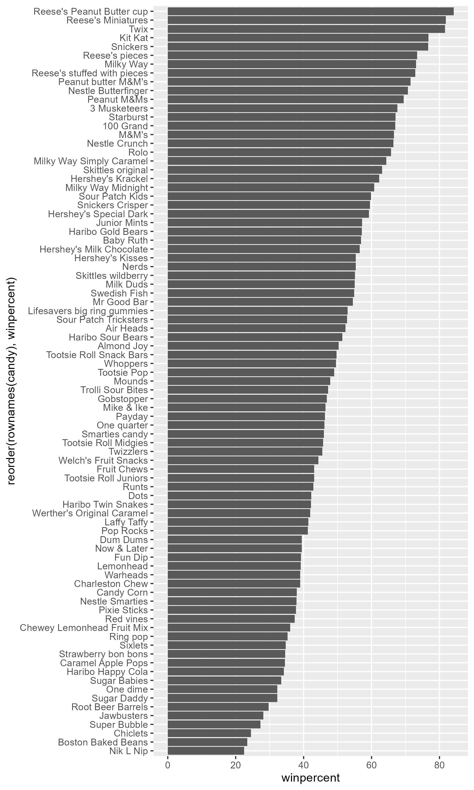
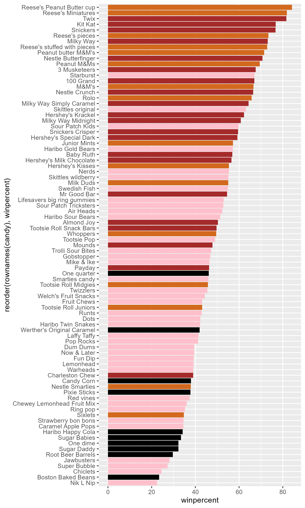
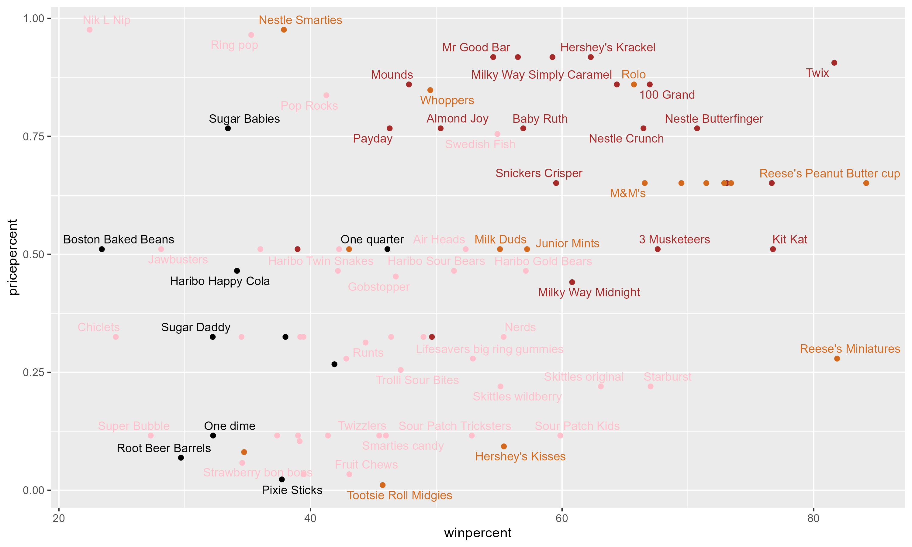

## Analysis of Candy Data

```{r}
candy_file <- "candy-data.csv"
candy = read.csv(candy_file, row.names = 1)
head(candy)
```

>Q1. How many different candy types are in this dataset?

```{r}
dim(candy)
```
There are 85 different candy types.

>Q2. How many fruity candy types are in the dataset?

```{r}
table(candy$fruity)
```
There are 38 fruity type candies in the data set.

>Q3. What is your favorite candy (other than Twix) in the dataset and what is it’s winpercent value?

My favorite candy are M&Ms:
```{r}
candy["M&M", ]$winpercent
```
M&Ms win percent was 66.57%

>Q4. What is the winpercent value for “Kit Kat”?

```{r}
candy["Kit Kat", ]$winpercent
```
Kit kats have a win percent of 76.77%

>Q5. What is the winpercent value for “Tootsie Roll Snack Bars”?

```{r}
candy["Tootsie Roll Snack Bars", ]$winpercent
```
Tootsie Roll Snack Bars had a win percent of 49.65%


#Using the Skim library to summarize candy 
```{r}
library(skimr)
skim(candy)
```

>Q6. Is there any variable/column that looks to be on a different scale to the majority of the other columns in the dataset?

Win percent is on a scale of around 50 while the rest of the variables are around 0.5.

>Q7. What do you think a zero and one represent for the candy$chocolate column? 

The 0 and 1s represent presence or absence with a 0 representing the candy does not contain the variable and a 1 representing it does. 

## Exploritory Analysis 

Analyzing the candy data set to visualize relationships between candies. 
>Q8. Plot a histogram of winpercent values using both base R an ggplot2.

```{r}
library(ggplot2)

hist(candy$winpercent)

ggplot(candy, aes(winpercent)) +
  geom_histogram(bins = 10)
```

>Q9 Is the distribution of winpercent values symmetrical?

the distribution of win percents are slightly skewed right towards candies with a high win percent. 

>Q10. Is the center of the distribution above or below 50%?

```{r}
median(candy$winpercent)
```
The center of the distribution is below 50%.

>Q11. On average is chocolate candy higher or lower ranked than fruit candy?

```{r}
library(dplyr)
chocolate <- candy %>%
  filter(chocolate == 1) 
fruity <- candy %>%
  filter(fruity == 1)
mean(chocolate$winpercent)
mean(fruity$winpercent)
```
On average, the chocolate candy had a win percent of 60.92% while the fruity candy had a win percent of 44.12%, so on average chocolate candy was ranked higher.

>Q12. Is this difference statistically significant?

```{r}
t.test(chocolate$winpercent, fruity$winpercent)
```
Since the p value for the t test comparison was 2.87e-8 which is less than 0.05, the difference between chocolate candy and fruity candy win rates are statistically significant. 

## Overall Candy Ranking

Ordering the data set by win percent

>Q13. What are the five least liked candy types in this set?

```{r}
ordered <- candy %>%
    arrange(winpercent)
head(ordered, 5)
```
The least liked candies were Nik L Nips, then Boston Baked Beans, Chiclets, Super Bubble, and Jawbusters.

>Q14. What are the top 5 all time favorite candy types out of this set?

```{r}
tail(ordered, 5)
```
The most liked candies were Reese's Peanut Butter cup, then Reese's Miniatures, Twix, Kit Kats, and Snickers. 

>Q15. Make a first barplot of candy ranking based on winpercent values.

```{r}
#| fig.show: "hide"
ggplot(candy, aes(winpercent, rownames(candy)))+
  geom_col()
  ggsave("barplot1.png", height = 10, width = 6)
```


>Q16. This is quite ugly, use the reorder() function to get the bars sorted by winpercent?

```{r}
#| fig.show: "hide"
ggplot(candy, aes(winpercent, reorder(rownames(candy), winpercent))) +
  geom_col()
 ggsave("barplot2.png", height = 10, width = 6)
```

# Adding color to the graph

Setting color values for each candy type 
```{r}
my_cols=rep("black", nrow(candy))
my_cols[as.logical(candy$chocolate)] = "chocolate"
my_cols[as.logical(candy$bar)] = "brown"
my_cols[as.logical(candy$fruity)] = "pink"
```

```{r}
#| fig.show: "hide"
ggplot(candy) + 
  aes(winpercent, reorder(rownames(candy),winpercent)) +
  geom_col(fill=my_cols) 
ggsave("barplot3.png", height = 10, width = 6)
```


>Q17. What is the worst ranked chocolate candy?

From the graph the worst ranking candy were Nik L Nips.

>Q18. What is the best ranked fruity candy?

From the graph the best ranked fruity candy were Starbursts.

## Comparing Win Percent and Price

```{r}
#| fig.show: "hide"
library(ggrepel)

ggplot(candy) +
  aes(winpercent, pricepercent, label=rownames(candy)) +
  geom_point(col=my_cols) + 
  geom_text_repel(col=my_cols, size=3.3, max.overlaps = 5)
ggsave("dotplot.png", height = 6, width = 10)
```


>Q19. Which candy type is the highest ranked in terms of winpercent for the least money - i.e. offers the most bang for your buck?

Reese's Miniatures have among the highest win percent while having a price percentile of around 25%.

>Q20. What are the top 5 most expensive candy types in the dataset and of these which is the least popular?

```{r}
head(candy %>% 
  arrange(desc(pricepercent)))
```

The top 5 most expensive candies are Nik L Nips, Nestle Smarties, Ring Pops, Hershey's Krackels, and Hershey's Milk Chocolate. The least popular most expensive candy were Nik L Nips. 

## Exploring the Corelation Strucutre 

Creating a correlation matrix of the candy types using the `corrplot` package. 

```{r}
library(corrplot)

cij <- cor(candy)
corrplot(cij)
```
>Q22. Examining this plot what two variables are anti-correlated (i.e. have minus values)?

The variables with the most anti correlation are chocolate and fruity and bar and pluribus. This means that it is unlikely that any candy will be both chocolate and fruity or a bar and in a pluribus packaging. 

>Q23. Similarly, what two variables are most positively correlated?

The most positively correlated variables are chocolate and winpercent. 

## Principal Component Analysis

```{r}
pca <- prcomp(candy, scale = T)
summary(pca)
```
Plotting PC1 and PC2

```{r}
plot(pca$x[, "PC1"], pca$x[, "PC2"])
```

```{r}
plot(pca$x[,1:2], col=my_cols, pch=16)
```
Plotting PCs with ggplot

```{r}
my_data <- cbind(candy, pca$x[, 1:3]) # only need first 3 principal components 

p <- ggplot(my_data) +
  aes(PC1, PC2, size=winpercent/100,  
  text=rownames(my_data),
  label=rownames(my_data)) +
  geom_point(col = my_cols) +
  geom_text_repel(size=3.3, col=my_cols, max.overlaps = 7)  + 
  theme(legend.position = "none") +
  labs(title="Halloween Candy PCA Space",
    subtitle="Colored by type: chocolate bar (dark brown), chocolate other (light brown), fruity (red), other (black)",
    caption="Data from 538")
p
```

Using the `plotly` package to generate an interactive plot for html documents 

```{r}
#| messege: false
#| warning: false
#library(plotly)
#ggplotly(p) turned off for pdf output
```

# Analyzing the PCA components

```{r}
ggplot(pca$rotation) +
  aes(PC1, reorder(rownames(pca$rotation), PC1)) +
  geom_col() +
  labs(y = "")
```
>Q24. Complete the code to generate the loadings plot above. What original variables are picked up strongly by PC1 in the positive direction? Do these make sense to you? Where did you see this relationship highlighted previously?

The original variables that are positively identified through PC1 were fruity, pluribus, and hard. This makes sense because a lot of fruity candies tend to be in hard candy formats and packaged in bundles. This was also seen in in the correlation matrix since the only positively correlated variables with fruity were hard and pluralists. 


>Q25. Based on your exploratory analysis, correlation findings, and PCA results, what combination of characteristics appears to make a “winning” candy? How do these different analyses (visualization, correlation, PCA) support or complement each other in reaching this conclusion?

A winning candies are typically chocolate, in a bar shape, and contain a peanut/nutty flavoring. From the visualization, it gives information about the general single categories that dominate the top win percentages such as how `chocolate` and `bar` typically have higher win percentages. From the correlation analysis, the top 3 highest correlated variables with win percent can be identified to further highlight specific variables that relate to win percent. Lastly from looking at PC1 components, `chocolate`, `bar`, and `peanutalmondy` are shown to have similar negative components as `winpercent` which further enforces how the presence of combinations of the 3 variables are related to the win percentages. 

