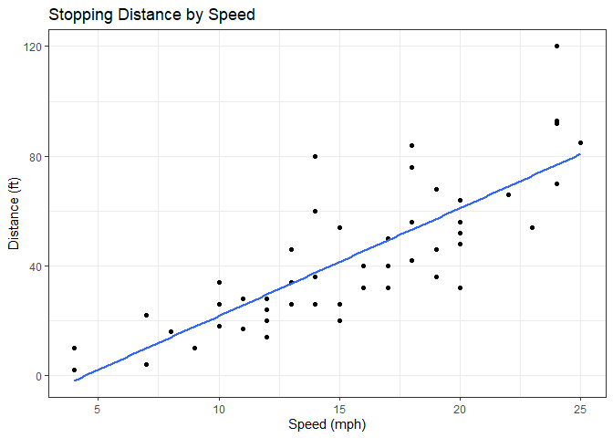
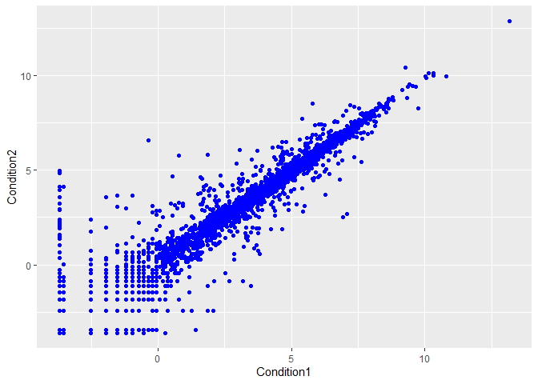
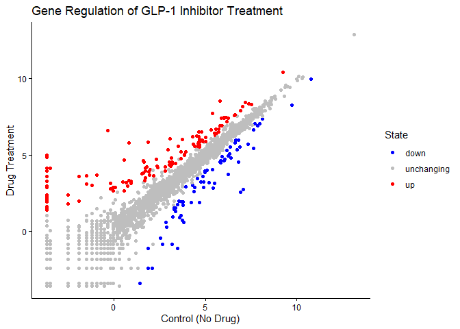
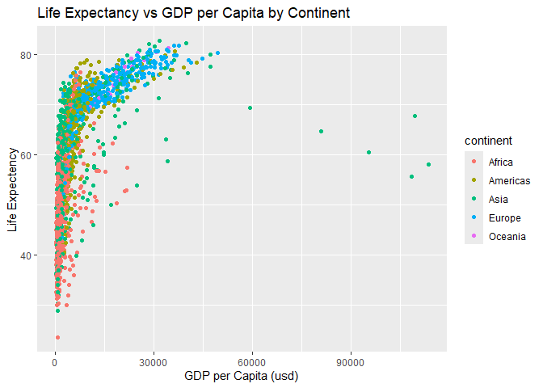
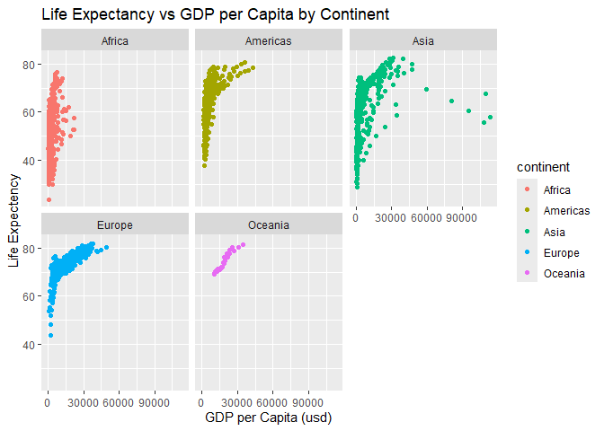
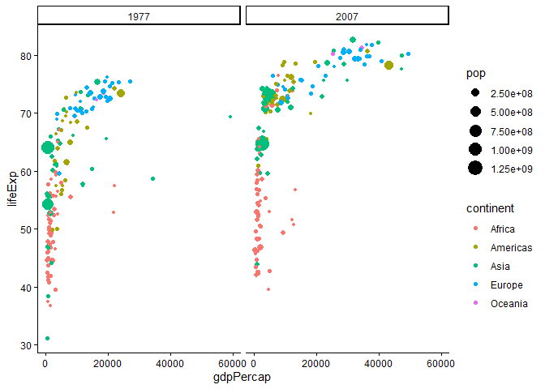

# Lab05
Max Wang

- [Background](#background)
- [Gene Expression Plot](#gene-expression-plot)
- [Further Exploration with
  gapminder](#further-exploration-with-gapminder)
- [Using the dplyr library](#using-the-dplyr-library)

## Background

There are lot’s of ways to make plots in R. These include so-called
“base R” (like the `plot()` function) and add on packages like
**ggplot2**

Let’s make the same plot with these two graphics systems. We can use the
inbuilt `cars` data set:

``` r
head(cars)
```

      speed dist
    1     4    2
    2     4   10
    3     7    4
    4     7   22
    5     8   16
    6     9   10

With “base R” we can make graphs using the `plot()` function

``` r
plot(cars)
```


Now using ggplot, first install the package using
`install.packages(ggplot2)`

> **N.B.** do not place install.packages in a code chunk otherwise it
> repeatedly installs every time the document is rendered.

after installation of the library, the library needs to be loaded with a
call to the function `library()`

``` r
#install.packages("ggplot2")  ggplot installation code 
library(ggplot2)
```

    Warning: package 'ggplot2' was built under R version 4.4.3

ggplot objects need at least 3 things:

1.  the `data` to use to be graphed
2.  the `aes` for aesthetics that map the data of the graph
3.  the `geom` for the plot type

``` r
  ggplot(data = cars) +
  aes(x = speed, y = dist) +
  geom_point() +
  geom_smooth(method = "lm", se = F) +
  labs(x = "Speed (mph)", y = "Distance (ft)", title = "Stopping Distance by Speed") + 
  theme_bw()
```

    `geom_smooth()` using formula = 'y ~ x'



## Gene Expression Plot

Using data on gene expression with and without GLP-1 inhibitors we can
plot a graph to highlight significant genes that are up or down
regulated.

``` r
url <- "https://bioboot.github.io/bimm143_S20/class-material/up_down_expression.txt"
genes <- read.delim(url)
head(genes)
```

            Gene Condition1 Condition2      State
    1      A4GNT -3.6808610 -3.4401355 unchanging
    2       AAAS  4.5479580  4.3864126 unchanging
    3      AASDH  3.7190695  3.4787276 unchanging
    4       AATF  5.0784720  5.0151916 unchanging
    5       AATK  0.4711421  0.5598642 unchanging
    6 AB015752.4 -3.6808610 -3.5921390 unchanging

version 1 plot - simple dot plot comparing gene expression with and
without treatment.

``` r
ggplot(genes) +
  aes(x = Condition1, y = Condition2) +
  geom_point(col = "blue")
```



Using the `State` value for each gene, we can color the graph based on
the state within `aes()` and specify the colors using
`scale_color_manual()`

``` r
ggplot(genes) +
  aes(x = Condition1, y = Condition2, col = State) +
  geom_point() +
  scale_color_manual(values = c("blue", "gray", "red")) +
  labs(x = "Control (No Drug)", 
       y = "Drug Treatment", 
       title = "Gene Regulation of GLP-1 Inhibitor Treatment") +
  theme_classic()
```



## Further Exploration with gapminder

Using the `gapminder` data set we look to explore further capabilities
of ggplot2

``` r
url <- "https://raw.githubusercontent.com/jennybc/gapminder/master/inst/extdata/gapminder.tsv"
gapminder <- read.delim(url)
head(gapminder)
```

          country continent year lifeExp      pop gdpPercap
    1 Afghanistan      Asia 1952  28.801  8425333  779.4453
    2 Afghanistan      Asia 1957  30.332  9240934  820.8530
    3 Afghanistan      Asia 1962  31.997 10267083  853.1007
    4 Afghanistan      Asia 1967  34.020 11537966  836.1971
    5 Afghanistan      Asia 1972  36.088 13079460  739.9811
    6 Afghanistan      Asia 1977  38.438 14880372  786.1134

> Q. How many rows (total entries) does the data set have

``` r
nrow(gapminder)
```

    [1] 1704

> how many different continents are in the data set

``` r
unique(gapminder$continent)
```

    [1] "Asia"     "Europe"   "Africa"   "Americas" "Oceania" 

Version 1 plot: `gdpPercap` vs `lifeExp`

``` r
ggplot(gapminder) +
  aes(x = gdpPercap, y = lifeExp, col = continent) +
  geom_point() +
  labs(x = "GDP per Capita (usd)", y = "Life Expectency", title = "Life Expectancy vs GDP per Capita by Continent")
```



Creating separate plots for each continent using the “faceting” feature
in ggplot:

``` r
ggplot(gapminder) +
  aes(x = gdpPercap, y = lifeExp, col = continent) +
  geom_point() +
  facet_wrap(~continent) +
  labs(x = "GDP per Capita (usd)", y = "Life Expectency", title = "Life Expectancy vs GDP per Capita by Continent")
```



## Using the dplyr library

Adding another package `dplyr` that allows for the usage of the
`filter()` function to select data points from the data set

``` r
library(dplyr)
```


    Attaching package: 'dplyr'

    The following objects are masked from 'package:stats':

        filter, lag

    The following objects are masked from 'package:base':

        intersect, setdiff, setequal, union

``` r
filter(gapminder, year == 2007, country == "United States")
```

            country continent year lifeExp       pop gdpPercap
    1 United States  Americas 2007  78.242 301139947  42951.65

``` r
input <- filter(gapminder, year == 2007 | year == 1977)
```

``` r
ggplot(input) +
  aes(x = gdpPercap, y = lifeExp, col = continent, size = pop) +
  geom_point() +
  facet_wrap(~year) +
  theme_classic()
```


