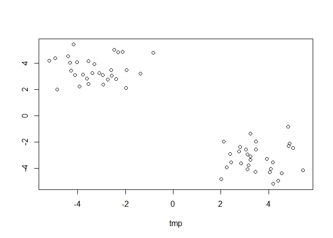
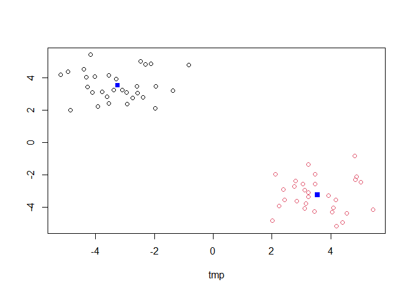
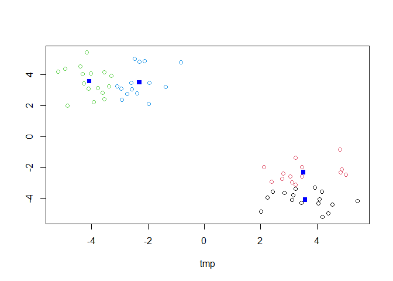
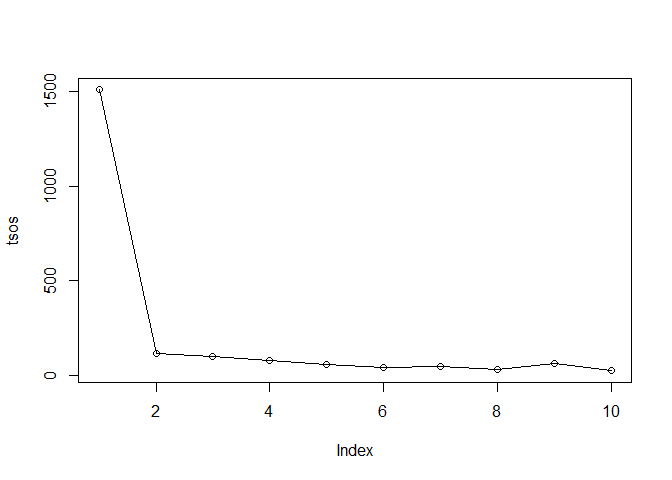
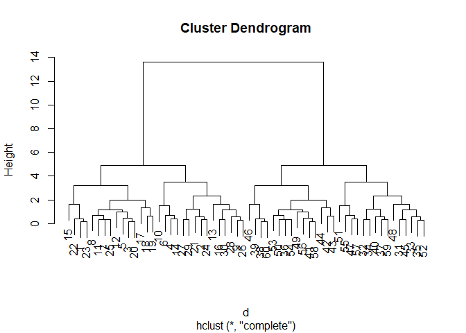
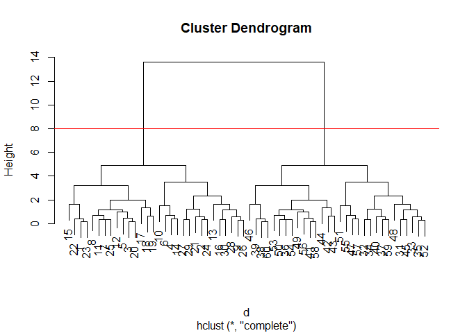
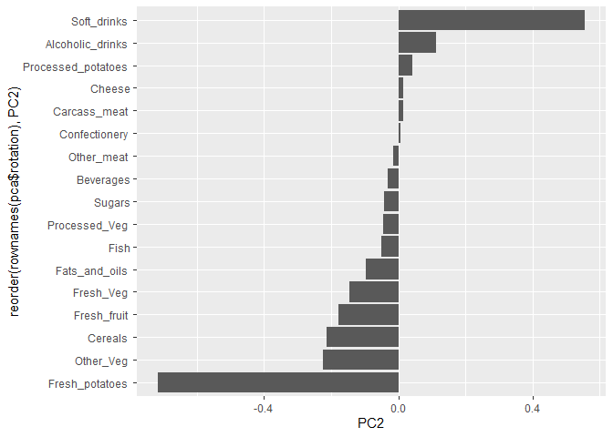

# lab07: Machine Learning 1
Max Wang

- [Background](#background)
- [K-means Clustering](#k-means-clustering)
- [Principal Component Analysis](#principal-component-analysis)
- [PCA to the rescue](#pca-to-the-rescue)

## Background

Start the exploration of machine learning methods, namely **clustering**
and **dimensionality reduction**.

Define test data for clustering with known natural “clusters”.

The function `rnorm()` produces a random number based on a normal
distribution with parameters for the distribution. rnorm(n, mean, sd)
defines the sample size and the normal distribution mean and sd.

> Q. generate 30 random numberes centered at 3 and another centered at
> -3 and plot them

``` r
x <- rnorm(30, 3)
y <- rnorm(30, -3)
tmp <- c(x,y)
z <- cbind(tmp, rev(tmp))
plot(z)
```



## K-means Clustering

The function `kmeans()` in “base R” is used for K-means clustering.

``` r
km <- kmeans(z, 2)
km
```

    K-means clustering with 2 clusters of sizes 30, 30

    Cluster means:
            tmp          
    1 -3.255998  3.548349
    2  3.548349 -3.255998

    Clustering vector:
     [1] 2 2 2 2 2 2 2 2 2 2 2 2 2 2 2 2 2 2 2 2 2 2 2 2 2 2 2 2 2 2 1 1 1 1 1 1 1 1
    [39] 1 1 1 1 1 1 1 1 1 1 1 1 1 1 1 1 1 1 1 1 1 1

    Within cluster sum of squares by cluster:
    [1] 59.16052 59.16052
     (between_SS / total_SS =  92.2 %)

    Available components:

    [1] "cluster"      "centers"      "totss"        "withinss"     "tot.withinss"
    [6] "betweenss"    "size"         "iter"         "ifault"      

> Q. Extracting the component of the results object that details cluster
> size, cluster centers, and cluster membership vector

``` r
km$size
```

    [1] 30 30

``` r
km$centers
```

            tmp          
    1 -3.255998  3.548349
    2  3.548349 -3.255998

``` r
km$cluster
```

     [1] 2 2 2 2 2 2 2 2 2 2 2 2 2 2 2 2 2 2 2 2 2 2 2 2 2 2 2 2 2 2 1 1 1 1 1 1 1 1
    [39] 1 1 1 1 1 1 1 1 1 1 1 1 1 1 1 1 1 1 1 1 1 1

> Plot of clustering results with points colored by cluster and cluster
> centeres as new points

``` r
plot(z, col = km$cluster)
points(km$centers, col = "blue", pch = 15)
```



> Q. Run kmeans instead with an n of 4 and create a results figure

``` r
k4 <- kmeans(z, 4)
plot(z, col = k4$cluster)
points(k4$centers, col = "blue", pch = 15)
```



Analyzing the total sum of squares value

``` r
km$tot.withinss
```

    [1] 118.321

``` r
k4$tot.withinss
```

    [1] 70.88453

creating a scree plot for number of clusters

``` r
tsos <- NULL
for (i in 1:10){
  kx <- kmeans(z, i)
  tsos <- c(tsos, kx$tot.withinss)
}
tsos
```

     [1] 1507.29512  118.32103   97.99815   77.86123   58.10150   43.94504
     [7]   47.03889   32.84231   65.58994   24.24525

``` r
plot(tsos, type = "o")
```



From the plot we can identify the scree point for this data set is 2
since 2 has the largest drop off for the total sum of squares. Thus, 2
clusters is optimal for `kmeans()` for this data set.

**N.B** Determining the scree point is integral to preventing bias in
data analysis since `kmeans()` will always impose n clusters onto the
data set which leads to a potential confirmation bias. Using a scree
plot helps to ensure the cluster count is actually optimal outside of
human judgment.

\#Hierarchical Clustering

The main function for Hierarchical Clustering is called `hclust()`
`hclust()` does not take the raw data, it requires a distance matrix
output by the function `dist()` which is a matrix of all distances
between points.

``` r
d <- dist(z)
hc <- hclust(d)
plot(hc)
```



To extract the cluster membership vector from the `hclust()` function
result, we have to “cut” the tree at certain heights to yield separate
groups/branches.

Essentially:

``` r
plot(hc)
abline(h = 8, col = "red")
```



Using the `cutree()` function on the `hclust()` result we can cut the
tree at height h which returns a vector for each point and their
respective cluster id.

``` r
grps <- cutree(hc, h = 8)
grps
```

     [1] 1 1 1 1 1 1 1 1 1 1 1 1 1 1 1 1 1 1 1 1 1 1 1 1 1 1 1 1 1 1 2 2 2 2 2 2 2 2
    [39] 2 2 2 2 2 2 2 2 2 2 2 2 2 2 2 2 2 2 2 2 2 2

compared to `kmeans()` output:

``` r
table(grps, km$cluster)
```

        
    grps  1  2
       1  0 30
       2 30  0

## Principal Component Analysis

PCA looks to reduce the multidimensional of the data but while only
losing a small amount of information. It produces principal vectors that
describe the data in lower dimensions (ex. like lines of best fit for
all dimensions of the data set). From the principal vectors
(eigenvectors), the distance to each point can be calculated
perpendicular to the new vector to capture the variance of the data in n
dimensions. By using eigenvectors for variance, it effectively rotates
the axes which variance is defined which can be used to drop axes with
low variance, reducing dimensions for analysis. The first principal axis
contains the most variation while the subsequent axes contain the least
variation.

Import the dataset for food consuption in the UK

``` r
url <- "https://tinyurl.com/UK-foods"
x <- read.csv(url)
head(x)
```

                   X England Wales Scotland N.Ireland
    1         Cheese     105   103      103        66
    2  Carcass_meat      245   227      242       267
    3    Other_meat      685   803      750       586
    4           Fish     147   160      122        93
    5 Fats_and_oils      193   235      184       209
    6         Sugars     156   175      147       139

Fixing the row names to make the `rownames()` the column 1 names and not
a separate column manually:

``` r
rownames(x) <- x[,1]
x <- x[,-1] # negative indices removed those columns from 
head(x)
```

                   England Wales Scotland N.Ireland
    Cheese             105   103      103        66
    Carcass_meat       245   227      242       267
    Other_meat         685   803      750       586
    Fish               147   160      122        93
    Fats_and_oils      193   235      184       209
    Sugars             156   175      147       139

Better method by adding the `row.names` argument in the `read.csv()`
method:

``` r
x <- read.csv(url, row.names = 1)
head(x)
```

                   England Wales Scotland N.Ireland
    Cheese             105   103      103        66
    Carcass_meat       245   227      242       267
    Other_meat         685   803      750       586
    Fish               147   160      122        93
    Fats_and_oils      193   235      184       209
    Sugars             156   175      147       139

\## Spotting major differences and trends

With 17 dimensions, identifying differences between each varaible is
difficult:

``` r
barplot(as.matrix(x), beside=T, col=rainbow(nrow(x)))
```


Pairs plot plots differences betwween each condition in a matrix

``` r
pairs(x, col=rainbow(nrow(x)), pch=16)
```


Heat maps

``` r
library(pheatmap)
```

    Warning: package 'pheatmap' was built under R version 4.4.3

``` r
pheatmap( as.matrix(x) )
```


## PCA to the rescue

The main PCA function in “base R” is the function `prcomp()`. for
`prcomp()` the data input needs to be in a longer format with variables
as rows and vice versa. Using the `t()` function we can rotate the data
set to be compatable with `prcomp()`.

``` r
pca <- prcomp(t(x))
summary(pca)
```

    Importance of components:
                                PC1      PC2      PC3       PC4
    Standard deviation     324.1502 212.7478 73.87622 3.176e-14
    Proportion of Variance   0.6744   0.2905  0.03503 0.000e+00
    Cumulative Proportion    0.6744   0.9650  1.00000 1.000e+00

Ordination plots (PC plots, score plots): creates a new plot along the
new axes with the principal axes.

``` r
attributes(pca)
```

    $names
    [1] "sdev"     "rotation" "center"   "scale"    "x"       

    $class
    [1] "prcomp"

To make one of the main PCA result figure the value `x` within the pca
object represents the score for each point for the plot.

Plotting PC1 to PC2 (since 96.5% of the variance is within these two
vectors):

``` r
library(ggplot2)
```

    Warning: package 'ggplot2' was built under R version 4.4.3

``` r
my_cols <- c("orange", "red","blue", "green")

ggplot(pca$x, aes(PC1, PC2)) +
  geom_point(color = my_cols)
```


The second major result figure unpacks the meaning behind each principal
axis called a “loadings plot” or “variable contributions plot” or
“weight plot”. Plotting the relative contribution of each variable to
each prinpal axis.

PC1:

``` r
ggplot(pca$rotation) +
  aes(PC1, reorder(rownames(pca$rotation), PC1)) +
  geom_col()
```


PC2

``` r
ggplot(pca$rotation) +
  aes(PC2, reorder(rownames(pca$rotation), PC2)) +
  geom_col()
```


