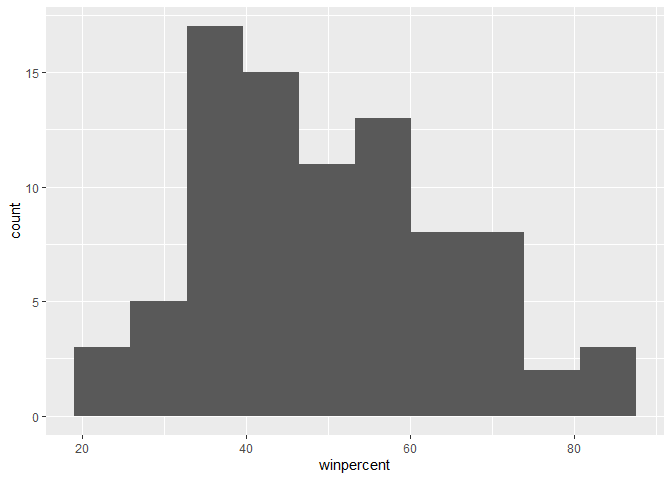
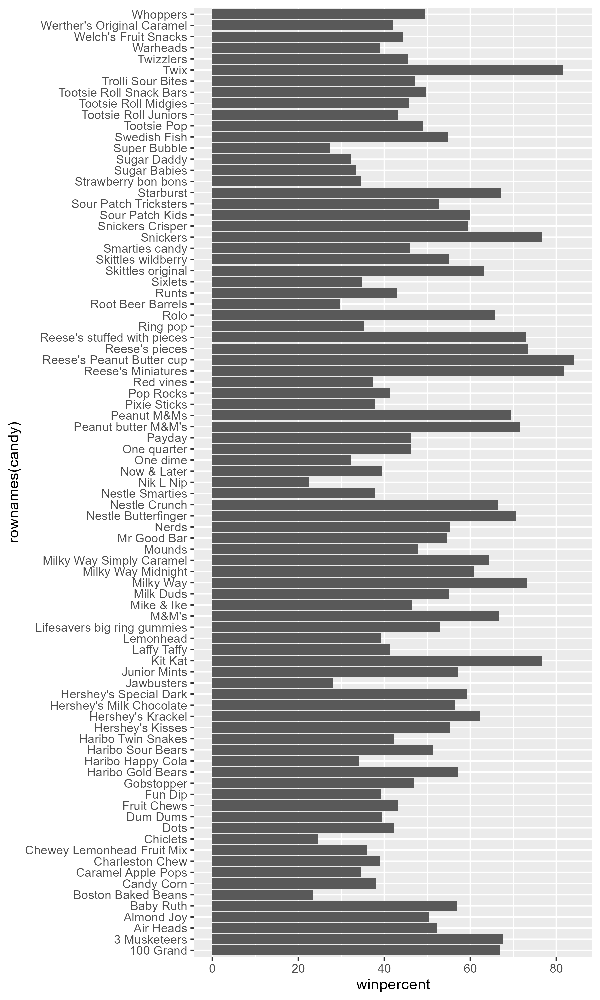
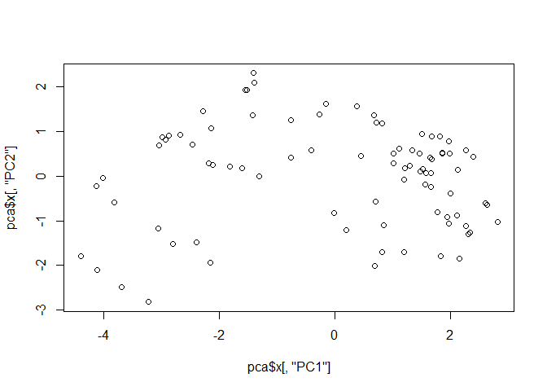
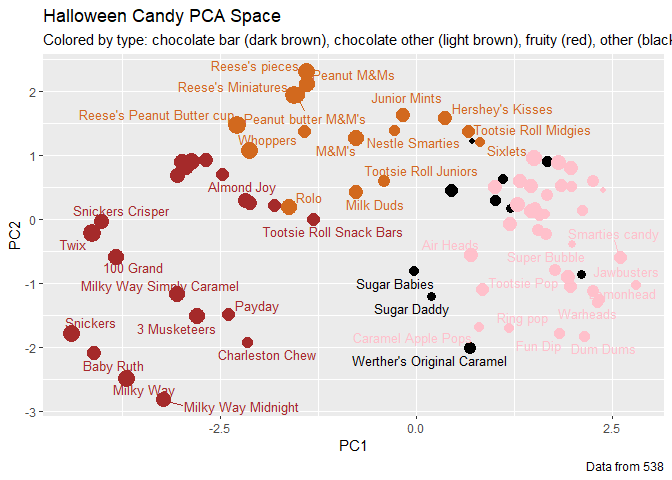
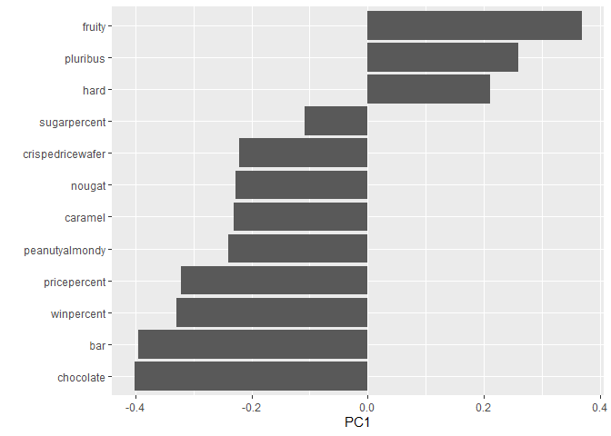

# lab09
Max Wang

- [Analysis of Candy Data](#analysis-of-candy-data)
- [Exploritory Analysis](#exploritory-analysis)
- [Overall Candy Ranking](#overall-candy-ranking)
- [Comparing Win Percent and Price](#comparing-win-percent-and-price)
- [Exploring the Corelation
  Strucutre](#exploring-the-corelation-strucutre)
- [Principal Component Analysis](#principal-component-analysis)
- [Analyzing the PCA components](#analyzing-the-pca-components)

## Analysis of Candy Data

``` r
candy_file <- "candy-data.csv"
candy = read.csv(candy_file, row.names = 1)
head(candy)
```

                 chocolate fruity caramel peanutyalmondy nougat crispedricewafer
    100 Grand            1      0       1              0      0                1
    3 Musketeers         1      0       0              0      1                0
    One dime             0      0       0              0      0                0
    One quarter          0      0       0              0      0                0
    Air Heads            0      1       0              0      0                0
    Almond Joy           1      0       0              1      0                0
                 hard bar pluribus sugarpercent pricepercent winpercent
    100 Grand       0   1        0        0.732        0.860   66.97173
    3 Musketeers    0   1        0        0.604        0.511   67.60294
    One dime        0   0        0        0.011        0.116   32.26109
    One quarter     0   0        0        0.011        0.511   46.11650
    Air Heads       0   0        0        0.906        0.511   52.34146
    Almond Joy      0   1        0        0.465        0.767   50.34755

> Q1. How many different candy types are in this dataset?

``` r
dim(candy)
```

    [1] 85 12

There are 85 different candy types.

> Q2. How many fruity candy types are in the dataset?

``` r
table(candy$fruity)
```


     0  1 
    47 38 

There are 38 fruity type candies in the data set.

> Q3. What is your favorite candy (other than Twix) in the dataset and
> what is it’s winpercent value?

My favorite candy are M&Ms:

``` r
candy["M&M", ]$winpercent
```

    [1] 66.57458

M&Ms win percent was 66.57%

> Q4. What is the winpercent value for “Kit Kat”?

``` r
candy["Kit Kat", ]$winpercent
```

    [1] 76.7686

Kit kats have a win percent of 76.77%

> Q5. What is the winpercent value for “Tootsie Roll Snack Bars”?

``` r
candy["Tootsie Roll Snack Bars", ]$winpercent
```

    [1] 49.6535

Tootsie Roll Snack Bars had a win percent of 49.65%

\#Using the Skim library to summarize candy

``` r
library(skimr)
```

    Warning: package 'skimr' was built under R version 4.4.3

``` r
skim(candy)
```

|                                                  |       |
|:-------------------------------------------------|:------|
| Name                                             | candy |
| Number of rows                                   | 85    |
| Number of columns                                | 12    |
| \_\_\_\_\_\_\_\_\_\_\_\_\_\_\_\_\_\_\_\_\_\_\_   |       |
| Column type frequency:                           |       |
| numeric                                          | 12    |
| \_\_\_\_\_\_\_\_\_\_\_\_\_\_\_\_\_\_\_\_\_\_\_\_ |       |
| Group variables                                  | None  |

Data summary

**Variable type: numeric**

| skim_variable | n_missing | complete_rate | mean | sd | p0 | p25 | p50 | p75 | p100 | hist |
|:---|---:|---:|---:|---:|---:|---:|---:|---:|---:|:---|
| chocolate | 0 | 1 | 0.44 | 0.50 | 0.00 | 0.00 | 0.00 | 1.00 | 1.00 | ▇▁▁▁▆ |
| fruity | 0 | 1 | 0.45 | 0.50 | 0.00 | 0.00 | 0.00 | 1.00 | 1.00 | ▇▁▁▁▆ |
| caramel | 0 | 1 | 0.16 | 0.37 | 0.00 | 0.00 | 0.00 | 0.00 | 1.00 | ▇▁▁▁▂ |
| peanutyalmondy | 0 | 1 | 0.16 | 0.37 | 0.00 | 0.00 | 0.00 | 0.00 | 1.00 | ▇▁▁▁▂ |
| nougat | 0 | 1 | 0.08 | 0.28 | 0.00 | 0.00 | 0.00 | 0.00 | 1.00 | ▇▁▁▁▁ |
| crispedricewafer | 0 | 1 | 0.08 | 0.28 | 0.00 | 0.00 | 0.00 | 0.00 | 1.00 | ▇▁▁▁▁ |
| hard | 0 | 1 | 0.18 | 0.38 | 0.00 | 0.00 | 0.00 | 0.00 | 1.00 | ▇▁▁▁▂ |
| bar | 0 | 1 | 0.25 | 0.43 | 0.00 | 0.00 | 0.00 | 0.00 | 1.00 | ▇▁▁▁▂ |
| pluribus | 0 | 1 | 0.52 | 0.50 | 0.00 | 0.00 | 1.00 | 1.00 | 1.00 | ▇▁▁▁▇ |
| sugarpercent | 0 | 1 | 0.48 | 0.28 | 0.01 | 0.22 | 0.47 | 0.73 | 0.99 | ▇▇▇▇▆ |
| pricepercent | 0 | 1 | 0.47 | 0.29 | 0.01 | 0.26 | 0.47 | 0.65 | 0.98 | ▇▇▇▇▆ |
| winpercent | 0 | 1 | 50.32 | 14.71 | 22.45 | 39.14 | 47.83 | 59.86 | 84.18 | ▃▇▆▅▂ |

> Q6. Is there any variable/column that looks to be on a different scale
> to the majority of the other columns in the dataset?

Win percent is on a scale of around 50 while the rest of the variables
are around 0.5.

> Q7. What do you think a zero and one represent for the
> candy\$chocolate column?

The 0 and 1s represent presence or absence with a 0 representing the
candy does not contain the variable and a 1 representing it does.

## Exploritory Analysis

Analyzing the candy data set to visualize relationships between candies.
\>Q8. Plot a histogram of winpercent values using both base R an
ggplot2.

``` r
library(ggplot2)
```

    Warning: package 'ggplot2' was built under R version 4.4.3

``` r
hist(candy$winpercent)
```


``` r
ggplot(candy, aes(winpercent)) +
  geom_histogram(bins = 10)
```



> Q9 Is the distribution of winpercent values symmetrical?

the distribution of win percents are slightly skewed right towards
candies with a high win percent.

> Q10. Is the center of the distribution above or below 50%?

``` r
median(candy$winpercent)
```

    [1] 47.82975

The center of the distribution is below 50%.

> Q11. On average is chocolate candy higher or lower ranked than fruit
> candy?

``` r
library(dplyr)
```


    Attaching package: 'dplyr'

    The following objects are masked from 'package:stats':

        filter, lag

    The following objects are masked from 'package:base':

        intersect, setdiff, setequal, union

``` r
chocolate <- candy %>%
  filter(chocolate == 1) 
fruity <- candy %>%
  filter(fruity == 1)
mean(chocolate$winpercent)
```

    [1] 60.92153

``` r
mean(fruity$winpercent)
```

    [1] 44.11974

On average, the chocolate candy had a win percent of 60.92% while the
fruity candy had a win percent of 44.12%, so on average chocolate candy
was ranked higher.

> Q12. Is this difference statistically significant?

``` r
t.test(chocolate$winpercent, fruity$winpercent)
```


        Welch Two Sample t-test

    data:  chocolate$winpercent and fruity$winpercent
    t = 6.2582, df = 68.882, p-value = 2.871e-08
    alternative hypothesis: true difference in means is not equal to 0
    95 percent confidence interval:
     11.44563 22.15795
    sample estimates:
    mean of x mean of y 
     60.92153  44.11974 

Since the p value for the t test comparison was 2.87e-8 which is less
than 0.05, the difference between chocolate candy and fruity candy win
rates are statistically significant.

## Overall Candy Ranking

Ordering the data set by win percent

> Q13. What are the five least liked candy types in this set?

``` r
ordered <- candy %>%
    arrange(winpercent)
head(ordered, 5)
```

                       chocolate fruity caramel peanutyalmondy nougat
    Nik L Nip                  0      1       0              0      0
    Boston Baked Beans         0      0       0              1      0
    Chiclets                   0      1       0              0      0
    Super Bubble               0      1       0              0      0
    Jawbusters                 0      1       0              0      0
                       crispedricewafer hard bar pluribus sugarpercent pricepercent
    Nik L Nip                         0    0   0        1        0.197        0.976
    Boston Baked Beans                0    0   0        1        0.313        0.511
    Chiclets                          0    0   0        1        0.046        0.325
    Super Bubble                      0    0   0        0        0.162        0.116
    Jawbusters                        0    1   0        1        0.093        0.511
                       winpercent
    Nik L Nip            22.44534
    Boston Baked Beans   23.41782
    Chiclets             24.52499
    Super Bubble         27.30386
    Jawbusters           28.12744

The least liked candies were Nik L Nips, then Boston Baked Beans,
Chiclets, Super Bubble, and Jawbusters.

> Q14. What are the top 5 all time favorite candy types out of this set?

``` r
tail(ordered, 5)
```

                              chocolate fruity caramel peanutyalmondy nougat
    Snickers                          1      0       1              1      1
    Kit Kat                           1      0       0              0      0
    Twix                              1      0       1              0      0
    Reese's Miniatures                1      0       0              1      0
    Reese's Peanut Butter cup         1      0       0              1      0
                              crispedricewafer hard bar pluribus sugarpercent
    Snickers                                 0    0   1        0        0.546
    Kit Kat                                  1    0   1        0        0.313
    Twix                                     1    0   1        0        0.546
    Reese's Miniatures                       0    0   0        0        0.034
    Reese's Peanut Butter cup                0    0   0        0        0.720
                              pricepercent winpercent
    Snickers                         0.651   76.67378
    Kit Kat                          0.511   76.76860
    Twix                             0.906   81.64291
    Reese's Miniatures               0.279   81.86626
    Reese's Peanut Butter cup        0.651   84.18029

The most liked candies were Reese’s Peanut Butter cup, then Reese’s
Miniatures, Twix, Kit Kats, and Snickers.

> Q15. Make a first barplot of candy ranking based on winpercent values.

``` r
ggplot(candy, aes(winpercent, rownames(candy)))+
  geom_col()
```

``` r
  ggsave("barplot1.png", height = 10, width = 6)
```



> Q16. This is quite ugly, use the reorder() function to get the bars
> sorted by winpercent?

``` r
ggplot(candy, aes(winpercent, reorder(rownames(candy), winpercent))) +
  geom_col()
```

``` r
 ggsave("barplot2.png", height = 10, width = 6)
```

 \# Adding color to the graph

Setting color values for each candy type

``` r
my_cols=rep("black", nrow(candy))
my_cols[as.logical(candy$chocolate)] = "chocolate"
my_cols[as.logical(candy$bar)] = "brown"
my_cols[as.logical(candy$fruity)] = "pink"
```

``` r
ggplot(candy) + 
  aes(winpercent, reorder(rownames(candy),winpercent)) +
  geom_col(fill=my_cols) 
```

``` r
ggsave("barplot3.png", height = 10, width = 6)
```


> Q17. What is the worst ranked chocolate candy?

From the graph the worst ranking candy were Nik L Nips.

> Q18. What is the best ranked fruity candy?

From the graph the best ranked fruity candy were Starbursts.

## Comparing Win Percent and Price

``` r
library(ggrepel)
```

    Warning: package 'ggrepel' was built under R version 4.4.3

``` r
ggplot(candy) +
  aes(winpercent, pricepercent, label=rownames(candy)) +
  geom_point(col=my_cols) + 
  geom_text_repel(col=my_cols, size=3.3, max.overlaps = 5)
```

    Warning: ggrepel: 54 unlabeled data points (too many overlaps). Consider
    increasing max.overlaps

``` r
ggsave("dotplot.png", height = 6, width = 10)
```

    Warning: ggrepel: 27 unlabeled data points (too many overlaps). Consider
    increasing max.overlaps


> Q19. Which candy type is the highest ranked in terms of winpercent for
> the least money - i.e. offers the most bang for your buck?

Reese’s Miniatures have among the highest win percent while having a
price percentile of around 25%.

> Q20. What are the top 5 most expensive candy types in the dataset and
> of these which is the least popular?

``` r
head(candy %>% 
  arrange(desc(pricepercent)))
```

                             chocolate fruity caramel peanutyalmondy nougat
    Nik L Nip                        0      1       0              0      0
    Nestle Smarties                  1      0       0              0      0
    Ring pop                         0      1       0              0      0
    Hershey's Krackel                1      0       0              0      0
    Hershey's Milk Chocolate         1      0       0              0      0
    Hershey's Special Dark           1      0       0              0      0
                             crispedricewafer hard bar pluribus sugarpercent
    Nik L Nip                               0    0   0        1        0.197
    Nestle Smarties                         0    0   0        1        0.267
    Ring pop                                0    1   0        0        0.732
    Hershey's Krackel                       1    0   1        0        0.430
    Hershey's Milk Chocolate                0    0   1        0        0.430
    Hershey's Special Dark                  0    0   1        0        0.430
                             pricepercent winpercent
    Nik L Nip                       0.976   22.44534
    Nestle Smarties                 0.976   37.88719
    Ring pop                        0.965   35.29076
    Hershey's Krackel               0.918   62.28448
    Hershey's Milk Chocolate        0.918   56.49050
    Hershey's Special Dark          0.918   59.23612

The top 5 most expensive candies are Nik L Nips, Nestle Smarties, Ring
Pops, Hershey’s Krackels, and Hershey’s Milk Chocolate. The least
popular most expensive candy were Nik L Nips.

## Exploring the Corelation Strucutre

Creating a correlation matrix of the candy types using the `corrplot`
package.

``` r
library(corrplot)
```

    Warning: package 'corrplot' was built under R version 4.4.3

    corrplot 0.95 loaded

``` r
cij <- cor(candy)
corrplot(cij)
```


> Q22. Examining this plot what two variables are anti-correlated
> (i.e. have minus values)?

The variables with the most anti correlation are chocolate and fruity
and bar and pluribus. This means that it is unlikely that any candy will
be both chocolate and fruity or a bar and in a pluribus packaging.

> Q23. Similarly, what two variables are most positively correlated?

The most positively correlated variables are chocolate and winpercent.

## Principal Component Analysis

``` r
pca <- prcomp(candy, scale = T)
summary(pca)
```

    Importance of components:
                              PC1    PC2    PC3     PC4    PC5     PC6     PC7
    Standard deviation     2.0788 1.1378 1.1092 1.07533 0.9518 0.81923 0.81530
    Proportion of Variance 0.3601 0.1079 0.1025 0.09636 0.0755 0.05593 0.05539
    Cumulative Proportion  0.3601 0.4680 0.5705 0.66688 0.7424 0.79830 0.85369
                               PC8     PC9    PC10    PC11    PC12
    Standard deviation     0.74530 0.67824 0.62349 0.43974 0.39760
    Proportion of Variance 0.04629 0.03833 0.03239 0.01611 0.01317
    Cumulative Proportion  0.89998 0.93832 0.97071 0.98683 1.00000

Plotting PC1 and PC2

``` r
plot(pca$x[, "PC1"], pca$x[, "PC2"])
```



``` r
plot(pca$x[,1:2], col=my_cols, pch=16)
```


Plotting PCs with ggplot

``` r
my_data <- cbind(candy, pca$x[, 1:3]) # only need first 3 principal components 

p <- ggplot(my_data) +
  aes(PC1, PC2, size=winpercent/100,  
  text=rownames(my_data),
  label=rownames(my_data)) +
  geom_point(col = my_cols) +
  geom_text_repel(size=3.3, col=my_cols, max.overlaps = 7)  + 
  theme(legend.position = "none") +
  labs(title="Halloween Candy PCA Space",
    subtitle="Colored by type: chocolate bar (dark brown), chocolate other (light brown), fruity (red), other (black)",
    caption="Data from 538")
p
```

    Warning: ggrepel: 43 unlabeled data points (too many overlaps). Consider
    increasing max.overlaps



Using the `plotly` package to generate an interactive plot for html
documents

``` r
#library(plotly)
#ggplotly(p) turned off for pdf output
```

# Analyzing the PCA components

``` r
ggplot(pca$rotation) +
  aes(PC1, reorder(rownames(pca$rotation), PC1)) +
  geom_col() +
  labs(y = "")
```



> Q24. Complete the code to generate the loadings plot above. What
> original variables are picked up strongly by PC1 in the positive
> direction? Do these make sense to you? Where did you see this
> relationship highlighted previously?

The original variables that are positively identified through PC1 were
fruity, pluribus, and hard. This makes sense because a lot of fruity
candies tend to be in hard candy formats and packaged in bundles. This
was also seen in in the correlation matrix since the only positively
correlated variables with fruity were hard and pluralists.

> Q25. Based on your exploratory analysis, correlation findings, and PCA
> results, what combination of characteristics appears to make a
> “winning” candy? How do these different analyses (visualization,
> correlation, PCA) support or complement each other in reaching this
> conclusion?

A winning candies are typically chocolate, in a bar shape, and contain a
peanut/nutty flavoring. From the visualization, it gives information
about the general single categories that dominate the top win
percentages such as how `chocolate` and `bar` typically have higher win
percentages. From the correlation analysis, the top 3 highest correlated
variables with win percent can be identified to further highlight
specific variables that relate to win percent. Lastly from looking at
PC1 components, `chocolate`, `bar`, and `peanutalmondy` are shown to
have similar negative components as `winpercent` which further enforces
how the presence of combinations of the 3 variables are related to the
win percentages.
