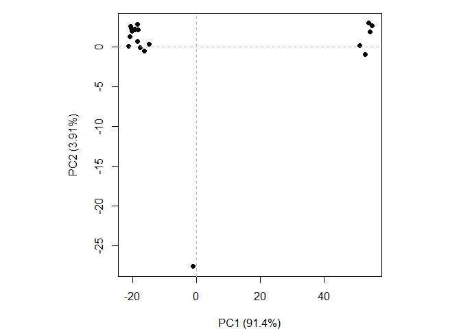

# lab10
Max Wang

- [PDB Statistics](#pdb-statistics)
- [Using Molstar](#using-molstar)
- [Bio3D in R](#bio3d-in-r)
- [Normal Mode Analysis](#normal-mode-analysis)
- [Comparative structure analysis of Adenylate
  Kinase](#comparative-structure-analysis-of-adenylate-kinase)

## PDB Statistics

The [Proteinn Data Bank (PDB)](https://www.rcsb.org/) is the main
repository of biomolecular structural data.

``` r
data <- read.csv("pdb_stats.csv", row.names = 1)
head(data)
```

                             X.ray    EM   NMR Integrative Multiple.methods Neutron
    Protein (only)          178795 21825 12773         343              226      84
    Protein/Oligosaccharide  10363  3564    34           8               11       1
    Protein/NA                9106  6335   287          24                7       0
    Nucleic acid (only)       3132   221  1566           3               15       3
    Other                      175    25    33           4                0       0
    Oligosaccharide (only)      11     0     6           0                1       0
                            Other  Total
    Protein (only)             32 214078
    Protein/Oligosaccharide     0  13981
    Protein/NA                  0  15759
    Nucleic acid (only)         1   4941
    Other                       0    237
    Oligosaccharide (only)      4     22

> Q1: What percentage of structures in the PDB are solved by X-Ray and
> Electron Microscopy.

``` r
c.sums <- colSums(data)
c.sums/c.sums["Total"] *100
```

               X.ray               EM              NMR      Integrative 
         80.95077464      12.83842935       5.90278614       0.15340257 
    Multiple.methods          Neutron            Other            Total 
          0.10441012       0.03533881       0.01485836     100.00000000 

80.95% of the PDB structures are solved by X-ray and 12.84% are solved
by electron microscopy.

> Q2: What proportion of structures in the PDB are protein?

``` r
sum(data$Total[1:3])/c.sums["Total"] *100
```

      Total 
    97.9118 

97.91% of all structures in the PDB database are proteins.

> Q3: Type HIV in the PDB website search box on the home page and
> determine how many HIV-1 protease structures are in the current PDB?

There are 1,173 structures for HIV proteases.

## Using Molstar

Using the [molstar viewer](https://molstar.org/viewer/) we can look to
view proteins of interest and highlight components.

With Mol\* visual representations can be made like:

.png)

.png)

> Q4: Water molecules normally have 3 atoms. Why do we see just one atom
> per water molecule in this structure?

Only 1 atom is visible because otherwise water would cause too much
visual clutter.

> Q5: There is a critical “conserved” water molecule in the binding
> site. Can you identify this water molecule? What residue number does
> this water molecule have

The water molecule has interactions with residue number ile50 because it
forms hydrogen bonds with the ile50 backbone on both subunits.

> Q6: Generate and save a figure clearly showing the two distinct chains
> of HIV-protease along with the ligand. You might also consider showing
> the catalytic residues ASP 25 in each chain and the critical water (we
> recommend “Ball & Stick” for these side-chains). Add this figure to
> your Quarto document.

.png)

> Q7: \[Optional\] As you have hopefully observed HIV protease is a
> homodimer (i.e. it is composed of two identical chains). With the aid
> of the graphic display can you identify secondary structure elements
> that are likely to only form in the dimer rather than the monomer?

.png)

## Bio3D in R

Accessing pdb data and loading the bio3d package

``` r
library(bio3d)
```

    Warning: package 'bio3d' was built under R version 4.4.3

``` r
hiv <- read.pdb("1hsg")
```

      Note: Accessing on-line PDB file

> Q7: How many amino acid residues are there in this pdb object?

198

> Q8: Name one of the two non-protein residues?

HOH (water)

> Q9: How many protein chains are in this structure?

2

Looking into the atom records

``` r
head(hiv$atom)
```

      type eleno elety  alt resid chain resno insert      x      y     z o     b
    1 ATOM     1     N <NA>   PRO     A     1   <NA> 29.361 39.686 5.862 1 38.10
    2 ATOM     2    CA <NA>   PRO     A     1   <NA> 30.307 38.663 5.319 1 40.62
    3 ATOM     3     C <NA>   PRO     A     1   <NA> 29.760 38.071 4.022 1 42.64
    4 ATOM     4     O <NA>   PRO     A     1   <NA> 28.600 38.302 3.676 1 43.40
    5 ATOM     5    CB <NA>   PRO     A     1   <NA> 30.508 37.541 6.342 1 37.87
    6 ATOM     6    CG <NA>   PRO     A     1   <NA> 29.296 37.591 7.162 1 38.40
      segid elesy charge
    1  <NA>     N   <NA>
    2  <NA>     C   <NA>
    3  <NA>     C   <NA>
    4  <NA>     O   <NA>
    5  <NA>     C   <NA>
    6  <NA>     C   <NA>

Exploring the `bio3dview` package that isnt on CRAN. Using the `remotes`
package to install a package from GitHub.

``` r
library(bio3dview)
library(NGLVieweR)
```

    Warning: package 'NGLVieweR' was built under R version 4.4.3

``` r
#view.pdb(hiv) |>
  #setSpin()
```

Highlighting certain residues

``` r
#sele <- atom.select(hiv, resno=25)
#view.pdb(hiv, cols=c("navy","teal"), 
         #highlight = sele,
         #highlight.style = "spacefill") |>
  #setRock()
```

## Normal Mode Analysis

Using normal mode analysis to predict the dynamics of the protein
Adenylate Kinase

``` r
adk <- read.pdb("6s36")
```

      Note: Accessing on-line PDB file
       PDB has ALT records, taking A only, rm.alt=TRUE

using the normal mode analyiss function on the adk object.

``` r
m <- nma(adk)
```

     Building Hessian...        Done in 0.03 seconds.
     Diagonalizing Hessian...   Done in 0.34 seconds.

Plotting results

``` r
plot(m)
```


Storing the data as a movie to be viewed in Mol\*

``` r
mktrj(m, file="adk_m7.pdb")
```

## Comparative structure analysis of Adenylate Kinase

Returning to HTML outputs.

accessing the pdb data for adenylate kinase

``` r
aa <- get.seq("1ake_A")
```

    Warning in get.seq("1ake_A"): Removing existing file: seqs.fasta

    Fetching... Please wait. Done.

``` r
aa
```

                 1        .         .         .         .         .         60 
    pdb|1AKE|A   MRIILLGAPGAGKGTQAQFIMEKYGIPQISTGDMLRAAVKSGSELGKQAKDIMDAGKLVT
                 1        .         .         .         .         .         60 

                61        .         .         .         .         .         120 
    pdb|1AKE|A   DELVIALVKERIAQEDCRNGFLLDGFPRTIPQADAMKEAGINVDYVLEFDVPDELIVDRI
                61        .         .         .         .         .         120 

               121        .         .         .         .         .         180 
    pdb|1AKE|A   VGRRVHAPSGRVYHVKFNPPKVEGKDDVTGEELTTRKDDQEETVRKRLVEYHQMTAPLIG
               121        .         .         .         .         .         180 

               181        .         .         .   214 
    pdb|1AKE|A   YYSKEAEAGNTKYAKVDGTKPVAEVRADLEKILG
               181        .         .         .   214 

    Call:
      read.fasta(file = outfile)

    Class:
      fasta

    Alignment dimensions:
      1 sequence rows; 214 position columns (214 non-gap, 0 gap) 

    + attr: id, ali, call

Feeding aa sequence into blast

``` r
blast <- blast.pdb(aa)
```

     Searching ... please wait (updates every 5 seconds) RID = V8SJGC1U014 
     ......
     Reporting 96 hits

``` r
head(blast$hit.tbl)
```

            queryid subjectids identity alignmentlength mismatches gapopens q.start
    1 Query_3901675     1AKE_A  100.000             214          0        0       1
    2 Query_3901675     8BQF_A   99.533             214          1        0       1
    3 Query_3901675     4X8M_A   99.533             214          1        0       1
    4 Query_3901675     6S36_A   99.533             214          1        0       1
    5 Query_3901675     9R6U_A   99.533             214          1        0       1
    6 Query_3901675     9R71_A   99.533             214          1        0       1
      q.end s.start s.end    evalue bitscore positives mlog.evalue pdb.id    acc
    1   214       1   214 1.79e-156      432    100.00    358.6211 1AKE_A 1AKE_A
    2   214      21   234 2.93e-156      433    100.00    358.1283 8BQF_A 8BQF_A
    3   214       1   214 3.21e-156      432    100.00    358.0370 4X8M_A 4X8M_A
    4   214       1   214 4.71e-156      432    100.00    357.6536 6S36_A 6S36_A
    5   214       1   214 1.05e-155      431     99.53    356.8519 9R6U_A 9R6U_A
    6   214       1   214 1.24e-155      431     99.53    356.6856 9R71_A 9R71_A

plotting the output into variable hits

``` r
hits <- plot(blast)
```

      * Possible cutoff values:    260 3 
                Yielding Nhits:    20 96 

      * Chosen cutoff value of:    260 
                Yielding Nhits:    20 


Top ids

``` r
head(hits$pdb.id)
```

    [1] "1AKE_A" "8BQF_A" "4X8M_A" "6S36_A" "9R6U_A" "9R71_A"

Downloading the “top hits” which will be ADK strucutres from the pdb
database.

``` r
files <- get.pdb(hits$pdb.id, path = "pdbs", split = T, gzip = T)
```

    Warning in get.pdb(hits$pdb.id, path = "pdbs", split = T, gzip = T):
    pdbs/1AKE.pdb exists. Skipping download

    Warning in get.pdb(hits$pdb.id, path = "pdbs", split = T, gzip = T):
    pdbs/8BQF.pdb exists. Skipping download

    Warning in get.pdb(hits$pdb.id, path = "pdbs", split = T, gzip = T):
    pdbs/4X8M.pdb exists. Skipping download

    Warning in get.pdb(hits$pdb.id, path = "pdbs", split = T, gzip = T):
    pdbs/6S36.pdb exists. Skipping download

    Warning in get.pdb(hits$pdb.id, path = "pdbs", split = T, gzip = T):
    pdbs/9R6U.pdb exists. Skipping download

    Warning in get.pdb(hits$pdb.id, path = "pdbs", split = T, gzip = T):
    pdbs/9R71.pdb exists. Skipping download

    Warning in get.pdb(hits$pdb.id, path = "pdbs", split = T, gzip = T):
    pdbs/8Q2B.pdb exists. Skipping download

    Warning in get.pdb(hits$pdb.id, path = "pdbs", split = T, gzip = T):
    pdbs/8RJ9.pdb exists. Skipping download

    Warning in get.pdb(hits$pdb.id, path = "pdbs", split = T, gzip = T):
    pdbs/6RZE.pdb exists. Skipping download

    Warning in get.pdb(hits$pdb.id, path = "pdbs", split = T, gzip = T):
    pdbs/4X8H.pdb exists. Skipping download

    Warning in get.pdb(hits$pdb.id, path = "pdbs", split = T, gzip = T):
    pdbs/3HPR.pdb exists. Skipping download

    Warning in get.pdb(hits$pdb.id, path = "pdbs", split = T, gzip = T):
    pdbs/1E4V.pdb exists. Skipping download

    Warning in get.pdb(hits$pdb.id, path = "pdbs", split = T, gzip = T):
    pdbs/5EJE.pdb exists. Skipping download

    Warning in get.pdb(hits$pdb.id, path = "pdbs", split = T, gzip = T):
    pdbs/1E4Y.pdb exists. Skipping download

    Warning in get.pdb(hits$pdb.id, path = "pdbs", split = T, gzip = T):
    pdbs/3X2S.pdb exists. Skipping download

    Warning in get.pdb(hits$pdb.id, path = "pdbs", split = T, gzip = T):
    pdbs/6HAP.pdb exists. Skipping download

    Warning in get.pdb(hits$pdb.id, path = "pdbs", split = T, gzip = T):
    pdbs/6HAM.pdb exists. Skipping download

    Warning in get.pdb(hits$pdb.id, path = "pdbs", split = T, gzip = T):
    pdbs/8PVW.pdb exists. Skipping download

    Warning in get.pdb(hits$pdb.id, path = "pdbs", split = T, gzip = T):
    pdbs/4K46.pdb exists. Skipping download

    Warning in get.pdb(hits$pdb.id, path = "pdbs", split = T, gzip = T):
    pdbs/4NP6.pdb exists. Skipping download


      |                                                                            
      |                                                                      |   0%
      |                                                                            
      |====                                                                  |   5%
      |                                                                            
      |=======                                                               |  10%
      |                                                                            
      |==========                                                            |  15%
      |                                                                            
      |==============                                                        |  20%
      |                                                                            
      |==================                                                    |  25%
      |                                                                            
      |=====================                                                 |  30%
      |                                                                            
      |========================                                              |  35%
      |                                                                            
      |============================                                          |  40%
      |                                                                            
      |================================                                      |  45%
      |                                                                            
      |===================================                                   |  50%
      |                                                                            
      |======================================                                |  55%
      |                                                                            
      |==========================================                            |  60%
      |                                                                            
      |==============================================                        |  65%
      |                                                                            
      |=================================================                     |  70%
      |                                                                            
      |====================================================                  |  75%
      |                                                                            
      |========================================================              |  80%
      |                                                                            
      |============================================================          |  85%
      |                                                                            
      |===============================================================       |  90%
      |                                                                            
      |==================================================================    |  95%
      |                                                                            
      |======================================================================| 100%

``` r
#path = declares where the data id downloaded, creates a new folder called "pdbs" for the pdb downlads 
```

Installing **BiocManager** from CRAN to install BioCondunctor. Using the
install function in BiocManager to install Biocondunctor:
`BiocManager::install("msa")`

Aligning the PDB files to superimpose structures.

``` r
pdbs <- pdbaln(files, fit = TRUE, exefile="msa") # fit = true aligns positions, exefile = calls the dependency from the msa package
```

    Reading PDB files:
    pdbs/split_chain/1AKE_A.pdb
    pdbs/split_chain/8BQF_A.pdb
    pdbs/split_chain/4X8M_A.pdb
    pdbs/split_chain/6S36_A.pdb
    pdbs/split_chain/9R6U_A.pdb
    pdbs/split_chain/9R71_A.pdb
    pdbs/split_chain/8Q2B_A.pdb
    pdbs/split_chain/8RJ9_A.pdb
    pdbs/split_chain/6RZE_A.pdb
    pdbs/split_chain/4X8H_A.pdb
    pdbs/split_chain/3HPR_A.pdb
    pdbs/split_chain/1E4V_A.pdb
    pdbs/split_chain/5EJE_A.pdb
    pdbs/split_chain/1E4Y_A.pdb
    pdbs/split_chain/3X2S_A.pdb
    pdbs/split_chain/6HAP_A.pdb
    pdbs/split_chain/6HAM_A.pdb
    pdbs/split_chain/8PVW_A.pdb
    pdbs/split_chain/4K46_A.pdb
    pdbs/split_chain/4NP6_A.pdb
       PDB has ALT records, taking A only, rm.alt=TRUE
    .   PDB has ALT records, taking A only, rm.alt=TRUE
    ..   PDB has ALT records, taking A only, rm.alt=TRUE
    .   PDB has ALT records, taking A only, rm.alt=TRUE
    .   PDB has ALT records, taking A only, rm.alt=TRUE
    .   PDB has ALT records, taking A only, rm.alt=TRUE
    .   PDB has ALT records, taking A only, rm.alt=TRUE
    .   PDB has ALT records, taking A only, rm.alt=TRUE
    ..   PDB has ALT records, taking A only, rm.alt=TRUE
    ..   PDB has ALT records, taking A only, rm.alt=TRUE
    ....   PDB has ALT records, taking A only, rm.alt=TRUE
    .   PDB has ALT records, taking A only, rm.alt=TRUE
    .   PDB has ALT records, taking A only, rm.alt=TRUE
    ..

    Extracting sequences

    pdb/seq: 1   name: pdbs/split_chain/1AKE_A.pdb 
       PDB has ALT records, taking A only, rm.alt=TRUE
    pdb/seq: 2   name: pdbs/split_chain/8BQF_A.pdb 
       PDB has ALT records, taking A only, rm.alt=TRUE
    pdb/seq: 3   name: pdbs/split_chain/4X8M_A.pdb 
    pdb/seq: 4   name: pdbs/split_chain/6S36_A.pdb 
       PDB has ALT records, taking A only, rm.alt=TRUE
    pdb/seq: 5   name: pdbs/split_chain/9R6U_A.pdb 
       PDB has ALT records, taking A only, rm.alt=TRUE
    pdb/seq: 6   name: pdbs/split_chain/9R71_A.pdb 
       PDB has ALT records, taking A only, rm.alt=TRUE
    pdb/seq: 7   name: pdbs/split_chain/8Q2B_A.pdb 
       PDB has ALT records, taking A only, rm.alt=TRUE
    pdb/seq: 8   name: pdbs/split_chain/8RJ9_A.pdb 
       PDB has ALT records, taking A only, rm.alt=TRUE
    pdb/seq: 9   name: pdbs/split_chain/6RZE_A.pdb 
       PDB has ALT records, taking A only, rm.alt=TRUE
    pdb/seq: 10   name: pdbs/split_chain/4X8H_A.pdb 
    pdb/seq: 11   name: pdbs/split_chain/3HPR_A.pdb 
       PDB has ALT records, taking A only, rm.alt=TRUE
    pdb/seq: 12   name: pdbs/split_chain/1E4V_A.pdb 
    pdb/seq: 13   name: pdbs/split_chain/5EJE_A.pdb 
       PDB has ALT records, taking A only, rm.alt=TRUE
    pdb/seq: 14   name: pdbs/split_chain/1E4Y_A.pdb 
    pdb/seq: 15   name: pdbs/split_chain/3X2S_A.pdb 
    pdb/seq: 16   name: pdbs/split_chain/6HAP_A.pdb 
    pdb/seq: 17   name: pdbs/split_chain/6HAM_A.pdb 
       PDB has ALT records, taking A only, rm.alt=TRUE
    pdb/seq: 18   name: pdbs/split_chain/8PVW_A.pdb 
       PDB has ALT records, taking A only, rm.alt=TRUE
    pdb/seq: 19   name: pdbs/split_chain/4K46_A.pdb 
       PDB has ALT records, taking A only, rm.alt=TRUE
    pdb/seq: 20   name: pdbs/split_chain/4NP6_A.pdb 

Viewing the strucutres with bio3view:

``` r
#view.pdbs(pdbs)
```

``` r
#view.pdbs(pdbs, colorScheme ="residue")
```

Running functions `rmsd()`, `rmsf()`, and `pca()` to display distance
between atoms from each structure

``` r
pc.xray <- pca(pdbs)
plot(pc.xray)
```


Plotting PC1 vs PC2

``` r
plot(pc.xray, 1:2)
```



Creating a movie to highlight the major motion of the dataset. Visualize
in molstar

``` r
pc1 <- mktrj(pc.xray, pc=1, file="pc_1.pdb")
```
