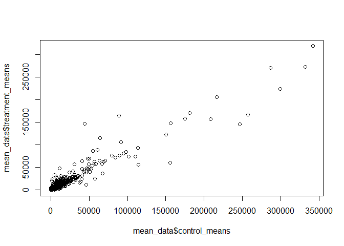
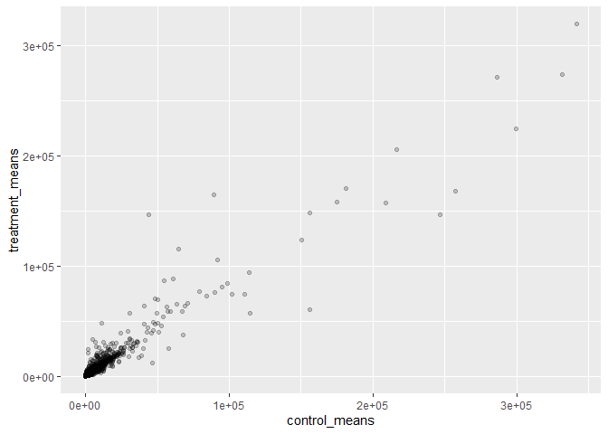
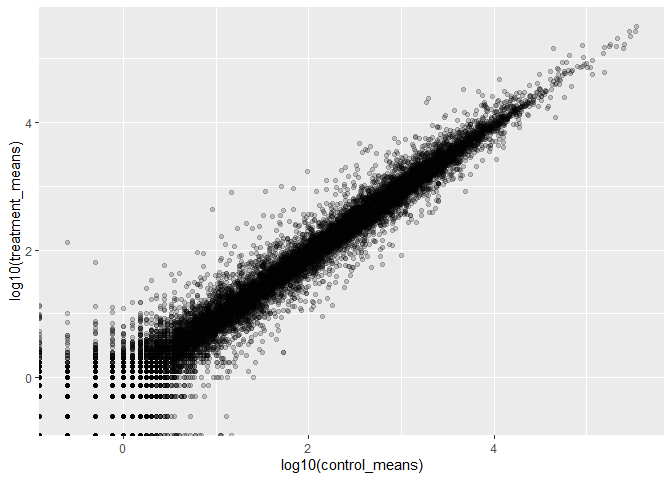
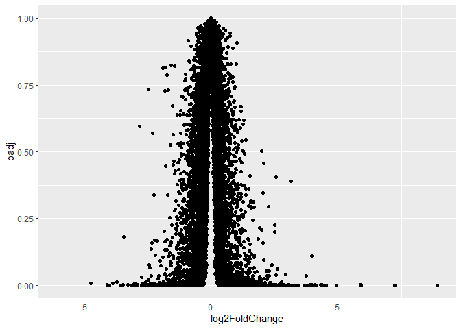
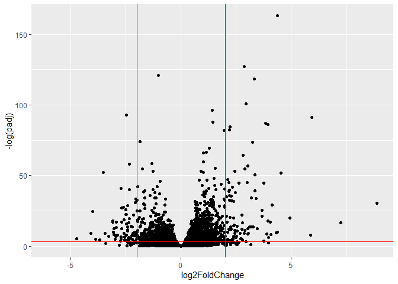
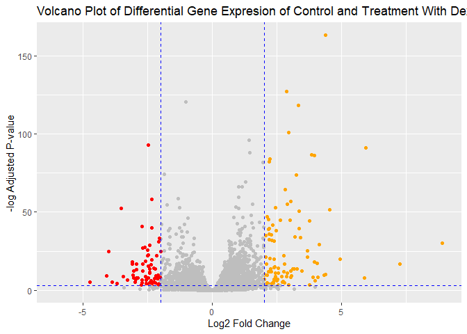

# lab13
Max Wang

- [Background](#background)
- [importing Data](#importing-data)
- [Checking metadata for matching
  ids](#checking-metadata-for-matching-ids)
- [Analysis of RNA Seq Data](#analysis-of-rna-seq-data)
- [Plotting ave counts of control vs
  treated](#plotting-ave-counts-of-control-vs-treated)
- [Log2 units and fold changes](#log2-units-and-fold-changes)
- [Removing zero count genes.](#removing-zero-count-genes)
- [DESeq Analysis](#deseq-analysis)
- [Volcano Plot](#volcano-plot)
- [Adding Plot Annotations](#adding-plot-annotations)
- [Saving results as CSV files](#saving-results-as-csv-files)
- [Saving annotated results as CSV
  files](#saving-annotated-results-as-csv-files)
- [Pathway Analysis](#pathway-analysis)

## Background

Using RNA seq analysis, we seek to find information about the effects of
dexamethasone (dex), a common steroid treatment for asthma by supressing
inflamation in airway smooth muscle (ASM)

## importing Data

Importing count data and metadata

The **count data** stores information about individual experiments and
the respective gene counts present given the sample.

The **metadata** stores information about the samples themselves.

``` r
counts <- read.csv("airway_scaledcounts.csv", row.names = 1)
metadata <-  read.csv("airway_metadata.csv", row.names = 1)
```

## Checking metadata for matching ids

Ensuring that the metadata row names matches the count data columns.

``` r
all(colnames(counts) == rownames(metadata))
```

    [1] TRUE

Counts sample ids match the metadata ids.

> Q1. How many genes are in this dataset?

``` r
nrow(counts)
```

    [1] 38694

There are 38694 genes in the dataset

> Q2. How many ‘control’ cell lines do we have?

``` r
table(metadata$dex)
```


    control treated 
          4       4 

There were 4 control cell lines.

## Analysis of RNA Seq Data

With 4 replicates per condition, we can calculate the mean expression
for each condition then observe the differences in expression through
DESeq.

Effectively first filter data by controled and treated, then find means
across all genes, then combine into one data frame

``` r
control_indecies <- metadata$dex == "control"
control_means <- rowMeans(counts[,control_indecies])
```

> Q3. How would you make the above code in either approach more robust?
> Is there a function that could help here?

The row means function can be used instead of rowSum / 4

> Q4. Follow the same procedure for the treated sample

``` r
treatment_indecies <- metadata$dex == "treated"
treatment_means <- rowMeans(counts[,treatment_indecies])
mean_data <- data.frame(control_means, treatment_means)
head(mean_data)
```

                    control_means treatment_means
    ENSG00000000003        900.75          658.00
    ENSG00000000005          0.00            0.00
    ENSG00000000419        520.50          546.00
    ENSG00000000457        339.75          316.50
    ENSG00000000460         97.25           78.75
    ENSG00000000938          0.75            0.00

## Plotting ave counts of control vs treated

> Q5 (a). Create a scatter plot showing the mean of the treated samples
> against the mean of the control samples. Your plot should look
> something like the following.

``` r
plot(mean_data$control_means, mean_data$treatment_means)
```



> Q5 (b).You could also use the ggplot2 package to make this figure
> producing the plot below. What geom\_?() function would you use for
> this plot?

``` r
library(ggplot2)
```

    Warning: package 'ggplot2' was built under R version 4.4.3

``` r
plot <- ggplot(mean_data, aes(control_means, treatment_means)) +
  geom_point(alpha = 0.2)
plot
```



You would use geom_point().

> Q6. Try plotting both axes on a log scale. What is the argument to
> plot() that allows you to do this?

the log10() function in the aes() allows to scale the axes.

``` r
plot <- ggplot(mean_data, aes(log10(control_means), log10(treatment_means))) +
  geom_point(alpha = 0.2)
plot
```



Scaled by a log scale to show all data equally.

## Log2 units and fold changes

Using the value treated/control counts it shows the difference between
the two expression levels. Then with this difference we can take a log2
value to show the fold difference

Ex.

``` r
#no change:
log2(20/20)
```

    [1] 0

``` r
#doubling
log2(40/20)
```

    [1] 1

``` r
#half
log2(10/20)
```

    [1] -1

> Adding new column `log2fc` for the log2 diff between the meancounts

``` r
mean_data$log2fc <- log2(mean_data$treatment_means/ mean_data$control_means)
```

## Removing zero count genes.

Typically zero count genes are not considered because they do not hold
any meaningful data. Thus they are excluded from analysis and further
consideration

``` r
zero.vals <- which(mean_data[,1:2] == 0, arr.ind=TRUE)
to.rm <- unique(zero.vals[,1])
mean_data_new <- mean_data[-to.rm,]
```

> Q7. What is the purpose of the arr.ind argument in the which()
> function call above? Why would we then take the first column of the
> output and need to call the unique() function?

The arr.ind argument makes the which function return incidences

## DESeq Analysis

Using the **DESeq** package, we can analyze the RNA seq data to find the
points with statistical significance. The first column is taken because
the which function produces both row and column indecisive. The unique()
function is called because if control and treated means are 0 then it
would be indexed twice.

``` r
library(DESeq2)
```

    Warning: package 'matrixStats' was built under R version 4.4.3

The DESeq package requires a specific input format of a data structure
object with specific data necessary for analysis. Creating a DESeq
object:

``` r
dds <- DESeqDataSetFromMatrix(countData = counts, 
                       colData = metadata, 
                       design = ~dex)
```

    converting counts to integer mode

    Warning in DESeqDataSet(se, design = design, ignoreRank): some variables in
    design formula are characters, converting to factors

Using the `DESeq()` function to run the analysis on the DESeq object
created.

``` r
dds <- DESeq(dds)
```

    estimating size factors

    estimating dispersions

    gene-wise dispersion estimates

    mean-dispersion relationship

    final dispersion estimates

    fitting model and testing

The `results()` function displays the results of a DESeq analysis output

``` r
res <- results(dds)
head(res)
```

    log2 fold change (MLE): dex treated vs control 
    Wald test p-value: dex treated vs control 
    DataFrame with 6 rows and 6 columns
                      baseMean log2FoldChange     lfcSE      stat    pvalue
                     <numeric>      <numeric> <numeric> <numeric> <numeric>
    ENSG00000000003 747.194195     -0.3507030  0.168246 -2.084470 0.0371175
    ENSG00000000005   0.000000             NA        NA        NA        NA
    ENSG00000000419 520.134160      0.2061078  0.101059  2.039475 0.0414026
    ENSG00000000457 322.664844      0.0245269  0.145145  0.168982 0.8658106
    ENSG00000000460  87.682625     -0.1471420  0.257007 -0.572521 0.5669691
    ENSG00000000938   0.319167     -1.7322890  3.493601 -0.495846 0.6200029
                         padj
                    <numeric>
    ENSG00000000003  0.163035
    ENSG00000000005        NA
    ENSG00000000419  0.176032
    ENSG00000000457  0.961694
    ENSG00000000460  0.815849
    ENSG00000000938        NA

## Volcano Plot

Volcano plots are ubiquitous summary figures for RNA Seq results which
plots plot2 fold differences vs the adjusted p values.

> Q. Using ggplot to make a volcano plot

``` r
ggplot(res, aes(log2FoldChange, padj)) +
  geom_point()
```

    Warning: Removed 23549 rows containing missing values or values outside the scale range
    (`geom_point()`).



Density of points results in overplotting while wasting space on high p
values. instead log transforming the padj.

``` r
ggplot(res, aes(log2FoldChange, -log(padj))) +
  geom_point() +
  geom_vline(xintercept = c(-2,2), col = "red") +
  geom_hline(yintercept = -log(0.05), col = "red")
```

    Warning: Removed 23549 rows containing missing values or values outside the scale range
    (`geom_point()`).



## Adding Plot Annotations

Adding color to points that are of interest and touches to the plot

``` r
mycols <- rep("gray", nrow(res))
mycols[res$log2FoldChange > 2] <- "orange"
mycols[res$log2FoldChange < -2] <- "red"
mycols[res$padj > 0.05] <- "gray"

ggplot(res, aes(log2FoldChange, -log(padj))) +
  geom_point(color = mycols) +
  geom_vline(xintercept = c(-2,2), col = "blue", lty = 2) +
  geom_hline(yintercept = -log(0.05), col = "blue", lty = 2) +
  labs(x = "Log2 Fold Change", y = "-log Adjusted P-value", title = "Volcano Plot of Differential Gene Expresion of Control and Treatment With Dexamethasone")
```

    Warning: Removed 23549 rows containing missing values or values outside the scale range
    (`geom_point()`).



> Q8. Using the up.ind vector above can you determine how many up
> regulated genes we have at the greater than 2 fc level?

``` r
sum(mean_data_new$log2fc > 2)
```

    [1] 250

There were 250 genes that were upregulated past 2 fc.

> Q9. Using the down.ind vector above can you determine how many down
> regulated genes we have at the greater than 2 fc level?

``` r
sum(mean_data_new$log2fc < -2)
```

    [1] 367

There were 367 genes that were downregulated past 2 fc.

> Q10. Do you trust these results? Why or why not?

These results do not show the p values associated with the fold changes
so I do no trust these results

## Saving results as CSV files

``` r
write.csv(res, file = "results.csv")
```

\##Adding Annotation Data

To highlight the specific biological pathways that the gene indices
represent, we must first assign the names to each id number. Mapping the
ENSMBLE ids to conventional **gene symbols**.

Using the 2 BioConductor packages`AnnotationDbi` and `org.Hs.eg.db`, we
can map ids to gene symbols.

``` r
library(AnnotationDbi)
library(org.Hs.eg.db)
```

The org.Hs.eg.db acts as a data file for human data from each database

``` r
columns(org.Hs.eg.db)
```

     [1] "ACCNUM"       "ALIAS"        "ENSEMBL"      "ENSEMBLPROT"  "ENSEMBLTRANS"
     [6] "ENTREZID"     "ENZYME"       "EVIDENCE"     "EVIDENCEALL"  "GENENAME"    
    [11] "GENETYPE"     "GO"           "GOALL"        "IPI"          "MAP"         
    [16] "OMIM"         "ONTOLOGY"     "ONTOLOGYALL"  "PATH"         "PFAM"        
    [21] "PMID"         "PROSITE"      "REFSEQ"       "SYMBOL"       "UCSCKG"      
    [26] "UNIPROT"     

``` r
res$symbol <- mapIds(org.Hs.eg.db, # the reference database
      key = row.names(res), # the ids to be mapped 
      keytype = "ENSEMBL", # the format of the ids
      column = "SYMBOL") # what to translate to 
```

    'select()' returned 1:many mapping between keys and columns

``` r
head(res)
```

    log2 fold change (MLE): dex treated vs control 
    Wald test p-value: dex treated vs control 
    DataFrame with 6 rows and 7 columns
                      baseMean log2FoldChange     lfcSE      stat    pvalue
                     <numeric>      <numeric> <numeric> <numeric> <numeric>
    ENSG00000000003 747.194195     -0.3507030  0.168246 -2.084470 0.0371175
    ENSG00000000005   0.000000             NA        NA        NA        NA
    ENSG00000000419 520.134160      0.2061078  0.101059  2.039475 0.0414026
    ENSG00000000457 322.664844      0.0245269  0.145145  0.168982 0.8658106
    ENSG00000000460  87.682625     -0.1471420  0.257007 -0.572521 0.5669691
    ENSG00000000938   0.319167     -1.7322890  3.493601 -0.495846 0.6200029
                         padj      symbol
                    <numeric> <character>
    ENSG00000000003  0.163035      TSPAN6
    ENSG00000000005        NA        TNMD
    ENSG00000000419  0.176032        DPM1
    ENSG00000000457  0.961694       SCYL3
    ENSG00000000460  0.815849       FIRRM
    ENSG00000000938        NA         FGR

> Q Further add gene names and entrizids to the res dataset

``` r
res$name <- mapIds(org.Hs.eg.db, 
      key = row.names(res), 
      keytype = "ENSEMBL", 
      column = "GENENAME") 
```

    'select()' returned 1:many mapping between keys and columns

``` r
res$entrezid <- mapIds(org.Hs.eg.db, 
      key = row.names(res), 
      keytype = "ENSEMBL", 
      column = "ENTREZID") 
```

    'select()' returned 1:many mapping between keys and columns

``` r
head(res)
```

    log2 fold change (MLE): dex treated vs control 
    Wald test p-value: dex treated vs control 
    DataFrame with 6 rows and 9 columns
                      baseMean log2FoldChange     lfcSE      stat    pvalue
                     <numeric>      <numeric> <numeric> <numeric> <numeric>
    ENSG00000000003 747.194195     -0.3507030  0.168246 -2.084470 0.0371175
    ENSG00000000005   0.000000             NA        NA        NA        NA
    ENSG00000000419 520.134160      0.2061078  0.101059  2.039475 0.0414026
    ENSG00000000457 322.664844      0.0245269  0.145145  0.168982 0.8658106
    ENSG00000000460  87.682625     -0.1471420  0.257007 -0.572521 0.5669691
    ENSG00000000938   0.319167     -1.7322890  3.493601 -0.495846 0.6200029
                         padj      symbol                   name    entrezid
                    <numeric> <character>            <character> <character>
    ENSG00000000003  0.163035      TSPAN6          tetraspanin 6        7105
    ENSG00000000005        NA        TNMD            tenomodulin       64102
    ENSG00000000419  0.176032        DPM1 dolichyl-phosphate m..        8813
    ENSG00000000457  0.961694       SCYL3 SCY1 like pseudokina..       57147
    ENSG00000000460  0.815849       FIRRM FIGNL1 interacting r..       55732
    ENSG00000000938        NA         FGR FGR proto-oncogene, ..        2268

## Saving annotated results as CSV files

``` r
write.csv(res, file = "results_annotated.csv")
```

## Pathway Analysis

Given the gene names in the res object, we can link differential gene
expression into pathways using databases like GO (gene oncology) or KEGG
(Kyoto encyclopedia of genes and genomes). This is called “pathway
analysis” or “gene set enrichment.”

The `gage` and the `pathview` package are used to do the analysis and
view the pathways respectively. `gageData` stores data on databases like
GO and KEGG

``` r
library(gage)
library(gageData)
library(pathview)
```

Information in gageData

``` r
data(kegg.sets.hs)
head(kegg.sets.hs,2)
```

    $`hsa00232 Caffeine metabolism`
    [1] "10"   "1544" "1548" "1549" "1553" "7498" "9"   

    $`hsa00983 Drug metabolism - other enzymes`
     [1] "10"     "1066"   "10720"  "10941"  "151531" "1548"   "1549"   "1551"  
     [9] "1553"   "1576"   "1577"   "1806"   "1807"   "1890"   "221223" "2990"  
    [17] "3251"   "3614"   "3615"   "3704"   "51733"  "54490"  "54575"  "54576" 
    [25] "54577"  "54578"  "54579"  "54600"  "54657"  "54658"  "54659"  "54963" 
    [33] "574537" "64816"  "7083"   "7084"   "7172"   "7363"   "7364"   "7365"  
    [41] "7366"   "7367"   "7371"   "7372"   "7378"   "7498"   "79799"  "83549" 
    [49] "8824"   "8833"   "9"      "978"   

Running pathway analysis using the `gage()` function from the `gage`
library. It takes the 2 inputs:

A vector of importance (the value analyzed, log2 fold change) labels
with proper ids for the database used

A database of pathways to check with

For **KEGG**, it only accepts ENTREZIDs.

``` r
foldchanges <- res$log2FoldChange
names(foldchanges) <- res$entrezid # vectors can also have index names 
head(foldchanges)
```

           7105       64102        8813       57147       55732        2268 
    -0.35070302          NA  0.20610777  0.02452695 -0.14714205 -1.73228897 

Running the `gage()` function

``` r
keggres <- gage(foldchanges, gsets = kegg.sets.hs)
head(keggres$less, 5)
```

                                                             p.geomean stat.mean
    hsa05332 Graft-versus-host disease                    0.0004250461 -3.473346
    hsa04940 Type I diabetes mellitus                     0.0017820293 -3.002352
    hsa05310 Asthma                                       0.0020045888 -3.009050
    hsa04672 Intestinal immune network for IgA production 0.0060434515 -2.560547
    hsa05330 Allograft rejection                          0.0073678825 -2.501419
                                                                 p.val      q.val
    hsa05332 Graft-versus-host disease                    0.0004250461 0.09053483
    hsa04940 Type I diabetes mellitus                     0.0017820293 0.14232581
    hsa05310 Asthma                                       0.0020045888 0.14232581
    hsa04672 Intestinal immune network for IgA production 0.0060434515 0.31387180
    hsa05330 Allograft rejection                          0.0073678825 0.31387180
                                                          set.size         exp1
    hsa05332 Graft-versus-host disease                          40 0.0004250461
    hsa04940 Type I diabetes mellitus                           42 0.0017820293
    hsa05310 Asthma                                             29 0.0020045888
    hsa04672 Intestinal immune network for IgA production       47 0.0060434515
    hsa05330 Allograft rejection                                36 0.0073678825

Making a figure to highlight a single pathway and the DEGs using the
`pathview()` function.

``` r
pathview(foldchanges, pathway.id = "hsa05310") # saves as a file in the directory
```

    'select()' returned 1:1 mapping between keys and columns

    Info: Working in directory C:/Users/eswan/OneDrive/Desktop/College Work/BIMM 143/Lab work/bimm143_github/Lab13

    Info: Writing image file hsa05310.pathview.png


> Q Generate additonal pathways for “Graft-versus-host disease” and
> “Type I diabetes mellitus”

``` r
pathview(foldchanges, pathway.id = "hsa05332") 
```

    'select()' returned 1:1 mapping between keys and columns

    Info: Working in directory C:/Users/eswan/OneDrive/Desktop/College Work/BIMM 143/Lab work/bimm143_github/Lab13

    Info: Writing image file hsa05332.pathview.png


``` r
pathview(foldchanges, pathway.id = "hsa04940") 
```

    'select()' returned 1:1 mapping between keys and columns

    Info: Working in directory C:/Users/eswan/OneDrive/Desktop/College Work/BIMM 143/Lab work/bimm143_github/Lab13

    Info: Writing image file hsa04940.pathview.png


