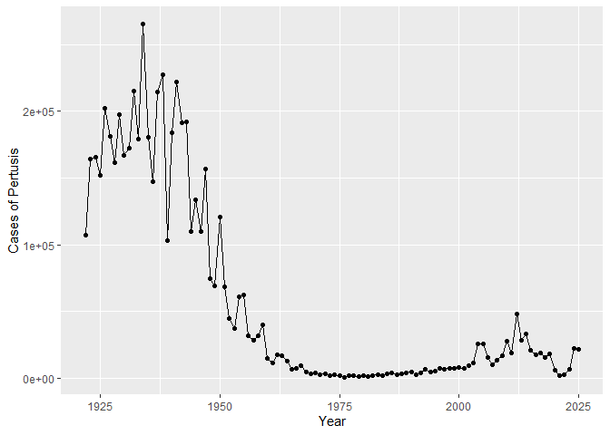
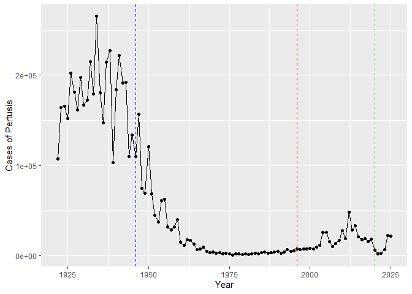
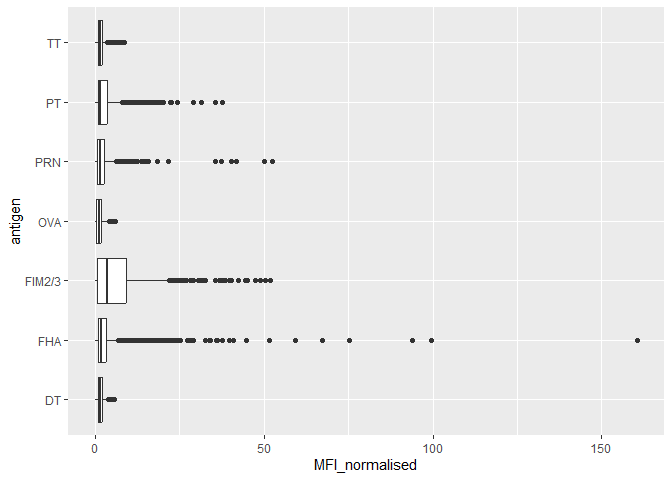
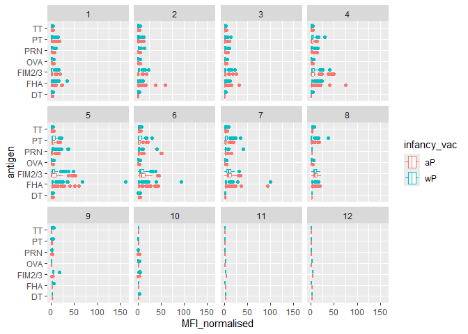
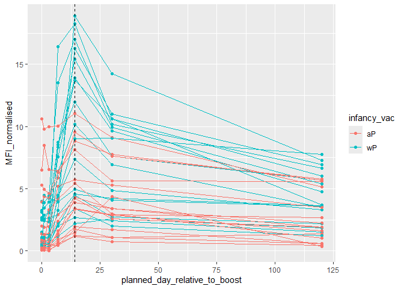
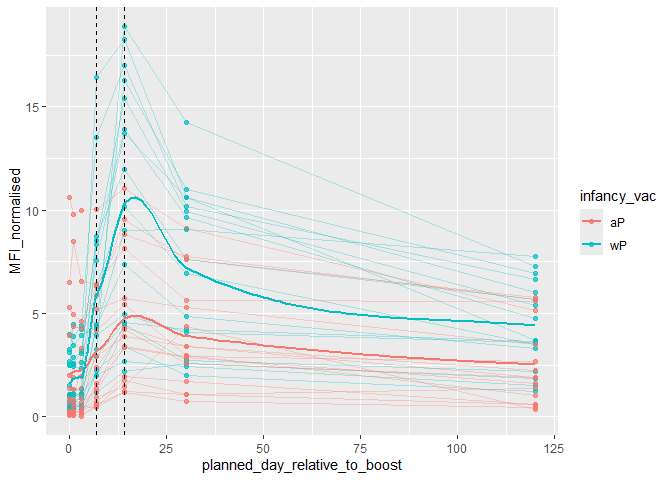

# lab18
Max Wang

- [Background](#background)
- [Loading PDB Data](#loading-pdb-data)
- [Focus on PT (Pertussis toxin)
  antigen](#focus-on-pt-pertussis-toxin-antigen)

## Background

Pertussis (also known as whooping cough) is a common lung disease caused
by the bacteria Bordetella pertussis. This disease can spread to all
individuals however when infecting infants below the age of 1, it
becomes a potentially deadly disease. To combat this, a vaccine was
developed in 1946 which protected against the disease. Recently however,
pertussis cases have increased resulting in a heightened risk for infant
death. This lab seeks to investigate cdc data to gain insight on the
potential sources of this increase.

## Loading PDB Data

From the cdc
[website](https://www.cdc.gov/pertussis/php/surveillance/pertussis-cases-by-year.html?CDC_AAref_Val=https://www.cdc.gov/pertussis/surv-reporting/cases-by-year.html)
we can scrape this data and store it as a data frame.

> Q1. With the help of the R “addin” package datapasta assign the CDC
> pertussis case number data to a data frame called cdc and use ggplot
> to make a plot of cases numbers over time.

``` r
library(datapasta)
```

    Warning: package 'datapasta' was built under R version 4.4.3

``` r
cdc <- data.frame(
  year = c(
    1922L,
    1923L,
    1924L,
    1925L,
    1926L,
    1927L,
    1928L,
    1929L,
    1930L,
    1931L,
    1932L,
    1933L,
    1934L,
    1935L,
    1936L,
    1937L,
    1938L,
    1939L,
    1940L,
    1941L,
    1942L,
    1943L,
    1944L,
    1945L,
    1946L,
    1947L,
    1948L,
    1949L,
    1950L,
    1951L,
    1952L,
    1953L,
    1954L,
    1955L,
    1956L,
    1957L,
    1958L,
    1959L,
    1960L,
    1961L,
    1962L,
    1963L,
    1964L,
    1965L,
    1966L,
    1967L,
    1968L,
    1969L,
    1970L,
    1971L,
    1972L,
    1973L,
    1974L,
    1975L,
    1976L,
    1977L,
    1978L,
    1979L,
    1980L,
    1981L,
    1982L,
    1983L,
    1984L,
    1985L,
    1986L,
    1987L,
    1988L,
    1989L,
    1990L,
    1991L,
    1992L,
    1993L,
    1994L,
    1995L,
    1996L,
    1997L,
    1998L,
    1999L,
    2000L,
    2001L,
    2002L,
    2003L,
    2004L,
    2005L,
    2006L,
    2007L,
    2008L,
    2009L,
    2010L,
    2011L,
    2012L,
    2013L,
    2014L,
    2015L,
    2016L,
    2017L,
    2018L,
    2019L,
    2020L,
    2021L,
    2022L,
    2023L,
    2024L,
    2025L
  ), cases = c(
    107473,
    164191,
    165418,
    152003,
    202210,
    181411,
    161799,
    197371,
    166914,
    172559,
    215343,
    179135,
    265269,
    180518,
    147237,
    214652,
    227319,
    103188,
    183866,
    222202,
    191383,
    191890,
    109873,
    133792,
    109860,
    156517,
    74715,
    69479,
    120718,
    68687,
    45030,
    37129,
    60886,
    62786,
    31732,
    28295,
    32148,
    40005,
    14809,
    11468,
    17749,
    17135,
    13005,
    6799,
    7717,
    9718,
    4810,
    3285,
    4249,
    3036,
    3287,
    1759,
    2402,
    1738,
    1010,
    2177,
    2063,
    1623,
    1730,
    1248,
    1895,
    2463,
    2276,
    3589,
    4195,
    2823,
    3450,
    4157,
    4570,
    2719,
    4083,
    6586,
    4617,
    5137,
    7796,
    6564,
    7405,
    7298,
    7867,
    7580,
    9771,
    11647,
    25827,
    25616,
    15632,
    10454,
    13278,
    16858,
    27550,
    18719,
    48277,
    28639,
    32971,
    20762,
    17972,
    18975,
    15609,
    18617,
    6124,
    2116,
    3044,
    7063,
    22538,
    21996
  )
)
```

> Q. Make a plot of `year` vs `cases`

``` r
library(ggplot2)
```

    Warning: package 'ggplot2' was built under R version 4.4.3

``` r
plot <- ggplot(cdc, aes(year, cases)) +
  geom_line() +
  geom_point() +
  labs(x = "Year", y = "Cases of Pertusis")
plot
```



> Q2 Adding some major milestones. The introduction of wP vacines in
> 1946, the swich to the newer aP vacine in 1996, and the COVID years in
> 2020.

``` r
plot <- ggplot(cdc, aes(year, cases)) +
  geom_line() +
  geom_point() +
  labs(x = "Year", y = "Cases of Pertusis") +
  geom_vline(xintercept = 1946, lty = 2, col = "blue") +
  geom_vline(xintercept = 1996, lty = 2, col = "red") +
  geom_vline(xintercept = 2020, lty = 2, col = "green")
plot
```



There were high case numbers before 1940 then cases dropped dramatically
and remained low between the 1970s and the 2000. After the early 2000s,
the case numbers suddenly rose again into the 2010s.

> Q3. Describe what happened after the introduction of the aP vaccine?
> Do you have a possible explanation for the observed trend?

After the introduction of the aP vaccine and a delay, there was a slow
increase in Pertussis cases. Furthermore considering case data in other
countries that switched suggest a similar offset between the aP vaccine
switch and new cases. This suggests that the aP vaccine seems to have a
degrading effect over time.

\##Investigation with the CMI-PB project

The Computational Models of Immunity - Pertussis Boost (CMI-PB) project
aims to provide information about how large scale implementation of the
aP vaccine to provide information about how the aP vaccines
effectiveness wanes over time compared to the wP vaccine.

This data is avaliable online in a JSON format via their
[website](https://www.cmi-pb.org/). To do so we can use the function
`read_jason()` from the jsonlite package.

``` r
library(jsonlite)

subject <- read_json("http://cmi-pb.org/api/v5_1/subject", simplifyVector = T)
head(subject)
```

      subject_id infancy_vac biological_sex              ethnicity  race
    1          1          wP         Female Not Hispanic or Latino White
    2          2          wP         Female Not Hispanic or Latino White
    3          3          wP         Female                Unknown White
    4          4          wP           Male Not Hispanic or Latino Asian
    5          5          wP           Male Not Hispanic or Latino Asian
    6          6          wP         Female Not Hispanic or Latino White
      year_of_birth date_of_boost      dataset
    1    1986-01-01    2016-09-12 2020_dataset
    2    1968-01-01    2019-01-28 2020_dataset
    3    1983-01-01    2016-10-10 2020_dataset
    4    1988-01-01    2016-08-29 2020_dataset
    5    1991-01-01    2016-08-29 2020_dataset
    6    1988-01-01    2016-10-10 2020_dataset

> Q4 how many wP and aP indidivuals are in the table:

``` r
table(subject$infancy_vac)
```


    aP wP 
    87 85 

There are 87 aP and 85 wP individuals ’

> Q5 what is the biological sex breakdown of the data set

``` r
table(subject$biological_sex)
```


    Female   Male 
       112     60 

There are 112 females and 60 males

> Q6 In terms of race and gender, is this representative of the US
> population

``` r
table(subject$race, subject$biological_sex)
```

                                               
                                                Female Male
      American Indian/Alaska Native                  0    1
      Asian                                         32   12
      Black or African American                      2    3
      More Than One Race                            15    4
      Native Hawaiian or Other Pacific Islander      1    1
      Unknown or Not Reported                       14    7
      White                                         48   32

It is not representative of the population however the data is still
usable due to the size and relative scope.

Reading more data tables:

``` r
specimen <- read_json("http://cmi-pb.org/api/v5_1/specimen", simplifyVector = T)
head(specimen)
```

      specimen_id subject_id actual_day_relative_to_boost
    1           1          1                           -3
    2           2          1                            1
    3           3          1                            3
    4           4          1                            7
    5           5          1                           11
    6           6          1                           32
      planned_day_relative_to_boost specimen_type visit
    1                             0         Blood     1
    2                             1         Blood     2
    3                             3         Blood     3
    4                             7         Blood     4
    5                            14         Blood     5
    6                            30         Blood     6

``` r
antibody <- read_json("http://cmi-pb.org/api/v5_1/plasma_ab_titer", simplifyVector = T)
head(antibody)
```

      specimen_id isotype is_antigen_specific antigen        MFI MFI_normalised
    1           1     IgE               FALSE   Total 1110.21154       2.493425
    2           1     IgE               FALSE   Total 2708.91616       2.493425
    3           1     IgG                TRUE      PT   68.56614       3.736992
    4           1     IgG                TRUE     PRN  332.12718       2.602350
    5           1     IgG                TRUE     FHA 1887.12263      34.050956
    6           1     IgE                TRUE     ACT    0.10000       1.000000
       unit lower_limit_of_detection
    1 UG/ML                 2.096133
    2 IU/ML                29.170000
    3 IU/ML                 0.530000
    4 IU/ML                 6.205949
    5 IU/ML                 4.679535
    6 IU/ML                 2.816431

For analysis, first merge the data using the the `*_join` function in
the **dplyr** library.

``` r
library(dplyr)
```


    Attaching package: 'dplyr'

    The following objects are masked from 'package:stats':

        filter, lag

    The following objects are masked from 'package:base':

        intersect, setdiff, setequal, union

``` r
meta <- inner_join(subject,specimen)
```

    Joining with `by = join_by(subject_id)`

``` r
head(meta)
```

      subject_id infancy_vac biological_sex              ethnicity  race
    1          1          wP         Female Not Hispanic or Latino White
    2          1          wP         Female Not Hispanic or Latino White
    3          1          wP         Female Not Hispanic or Latino White
    4          1          wP         Female Not Hispanic or Latino White
    5          1          wP         Female Not Hispanic or Latino White
    6          1          wP         Female Not Hispanic or Latino White
      year_of_birth date_of_boost      dataset specimen_id
    1    1986-01-01    2016-09-12 2020_dataset           1
    2    1986-01-01    2016-09-12 2020_dataset           2
    3    1986-01-01    2016-09-12 2020_dataset           3
    4    1986-01-01    2016-09-12 2020_dataset           4
    5    1986-01-01    2016-09-12 2020_dataset           5
    6    1986-01-01    2016-09-12 2020_dataset           6
      actual_day_relative_to_boost planned_day_relative_to_boost specimen_type
    1                           -3                             0         Blood
    2                            1                             1         Blood
    3                            3                             3         Blood
    4                            7                             7         Blood
    5                           11                            14         Blood
    6                           32                            30         Blood
      visit
    1     1
    2     2
    3     3
    4     4
    5     5
    6     6

``` r
abdata <- inner_join(antibody, meta)
```

    Joining with `by = join_by(specimen_id)`

``` r
head(abdata)
```

      specimen_id isotype is_antigen_specific antigen        MFI MFI_normalised
    1           1     IgE               FALSE   Total 1110.21154       2.493425
    2           1     IgE               FALSE   Total 2708.91616       2.493425
    3           1     IgG                TRUE      PT   68.56614       3.736992
    4           1     IgG                TRUE     PRN  332.12718       2.602350
    5           1     IgG                TRUE     FHA 1887.12263      34.050956
    6           1     IgE                TRUE     ACT    0.10000       1.000000
       unit lower_limit_of_detection subject_id infancy_vac biological_sex
    1 UG/ML                 2.096133          1          wP         Female
    2 IU/ML                29.170000          1          wP         Female
    3 IU/ML                 0.530000          1          wP         Female
    4 IU/ML                 6.205949          1          wP         Female
    5 IU/ML                 4.679535          1          wP         Female
    6 IU/ML                 2.816431          1          wP         Female
                   ethnicity  race year_of_birth date_of_boost      dataset
    1 Not Hispanic or Latino White    1986-01-01    2016-09-12 2020_dataset
    2 Not Hispanic or Latino White    1986-01-01    2016-09-12 2020_dataset
    3 Not Hispanic or Latino White    1986-01-01    2016-09-12 2020_dataset
    4 Not Hispanic or Latino White    1986-01-01    2016-09-12 2020_dataset
    5 Not Hispanic or Latino White    1986-01-01    2016-09-12 2020_dataset
    6 Not Hispanic or Latino White    1986-01-01    2016-09-12 2020_dataset
      actual_day_relative_to_boost planned_day_relative_to_boost specimen_type
    1                           -3                             0         Blood
    2                           -3                             0         Blood
    3                           -3                             0         Blood
    4                           -3                             0         Blood
    5                           -3                             0         Blood
    6                           -3                             0         Blood
      visit
    1     1
    2     1
    3     1
    4     1
    5     1
    6     1

> Q What antibody isotypes are measured for these patients

``` r
table(abdata$isotype)
```


      IgE   IgG  IgG1  IgG2  IgG3  IgG4 
     6698  7265 11993 12000 12000 12000 

> Q11. How many specimens (i.e. entries in abdata) do we have for each
> isotype?

``` r
table(abdata$antigen)
```


        ACT   BETV1      DT   FELD1     FHA  FIM2/3   LOLP1     LOS Measles     OVA 
       1970    1970    6318    1970    6712    6318    1970    1970    1970    6318 
        PD1     PRN      PT     PTM   Total      TT 
       1970    6712    6712    1970     788    6318 

> Q12. What are the different \$dataset values in abdata and what do you
> notice about the number of rows for the most “recent” dataset?

``` r
table(abdata$dataset)
```


    2020_dataset 2021_dataset 2022_dataset 2023_dataset 
           31520         8085         7301        15050 

The most recent dataset has significantly more observations than the
previous two datasets but its still smaller than the first 2020 dataset.

Looking at the IgG isotype, plotting the MFI_normalized for all
antigens.

``` r
igg <- abdata %>% 
  filter(isotype == "IgG")
```

``` r
ggplot(igg, aes(MFI_normalised, antigen)) +
  geom_boxplot()
```



> Q Is there a difference between aP vs wP values

``` r
ggplot(igg, aes(MFI_normalised, antigen, col = infancy_vac)) +
  geom_boxplot() + 
  facet_wrap(~visit)
```



## Focus on PT (Pertussis toxin) antigen

``` r
pt_igg_2021 <- igg %>% 
  filter(antigen == "PT") %>%
  filter(dataset == "2021_dataset")
head(pt_igg_2021)
```

      specimen_id isotype is_antigen_specific antigen    MFI MFI_normalised unit
    1         468     IgG               FALSE      PT 112.75      1.0000000  MFI
    2         469     IgG               FALSE      PT 111.25      0.9866962  MFI
    3         470     IgG               FALSE      PT 125.50      1.1130820  MFI
    4         471     IgG               FALSE      PT 224.25      1.9889135  MFI
    5         472     IgG               FALSE      PT 304.00      2.6962306  MFI
    6         473     IgG               FALSE      PT 274.00      2.4301552  MFI
      lower_limit_of_detection subject_id infancy_vac biological_sex
    1                 5.197441         61          wP         Female
    2                 5.197441         61          wP         Female
    3                 5.197441         61          wP         Female
    4                 5.197441         61          wP         Female
    5                 5.197441         61          wP         Female
    6                 5.197441         61          wP         Female
                   ethnicity                    race year_of_birth date_of_boost
    1 Not Hispanic or Latino Unknown or Not Reported    1987-01-01    2019-04-08
    2 Not Hispanic or Latino Unknown or Not Reported    1987-01-01    2019-04-08
    3 Not Hispanic or Latino Unknown or Not Reported    1987-01-01    2019-04-08
    4 Not Hispanic or Latino Unknown or Not Reported    1987-01-01    2019-04-08
    5 Not Hispanic or Latino Unknown or Not Reported    1987-01-01    2019-04-08
    6 Not Hispanic or Latino Unknown or Not Reported    1987-01-01    2019-04-08
           dataset actual_day_relative_to_boost planned_day_relative_to_boost
    1 2021_dataset                           -4                             0
    2 2021_dataset                            1                             1
    3 2021_dataset                            3                             3
    4 2021_dataset                            7                             7
    5 2021_dataset                           14                            14
    6 2021_dataset                           30                            30
      specimen_type visit
    1         Blood     1
    2         Blood     2
    3         Blood     3
    4         Blood     4
    5         Blood     5
    6         Blood     6

Plotting the PT antigen experssion over time

``` r
ggplot(pt_igg_2021, aes(planned_day_relative_to_boost, MFI_normalised, col = infancy_vac, group = subject_id)) +
  geom_point() +
  geom_line()+
  geom_vline(xintercept = 14, lty = 2, col = "black")
```



Adding polish and a trend line

``` r
ggplot(pt_igg_2021, aes(planned_day_relative_to_boost, MFI_normalised, col = infancy_vac, group = subject_id)) +
  geom_point(alpha = 0.7) +
  geom_line(alpha = 0.3)+
  geom_vline(xintercept = 14, lty = 2, col = "black") +
  geom_vline(xintercept = 7, lty = 2, col = "black") +
  geom_smooth(data = subset(pt_igg_2021, planned_day_relative_to_boost <= 7), aes(group = infancy_vac), se = FALSE) +
  geom_smooth(data = subset(pt_igg_2021, planned_day_relative_to_boost >= 7), aes(group = infancy_vac), se = FALSE)
```

    `geom_smooth()` using method = 'loess' and formula = 'y ~ x'
    `geom_smooth()` using method = 'loess' and formula = 'y ~ x'


