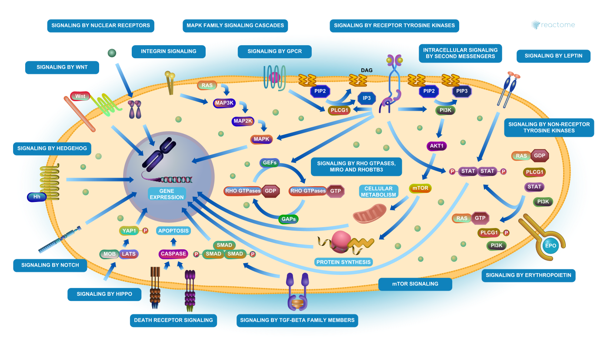

## Background

The data from the project came from a knockdown experiment studying the effects of the HOX gene.

## Data Import

```{r}
counts <- read.csv("GSE37704_featurecounts.csv", row.names = 1)
metadata <- read.csv("GSE37704_metadata.csv", row.names = 1)

head(counts)
metadata
```

### Clean up

Checking for ids to align from counts and metadata

```{r}
new.counts <- counts[2:ncol(counts)]
all(colnames(new.counts) == rownames(metadata))
```
Removing zero count genes

```{r}

library(dplyr)
new.counts <- new.counts %>%
  filter(rowSums(new.counts) > 0)
```


## DESeq Analysis


### Imput Object

Loading the `DESeq2` library 
```{r, message = F} 
library(DESeq2)
```

Loading the data into a variable 
```{r}
dds <- DESeqDataSetFromMatrix(countData = new.counts,
                       colData = metadata,
                       design = ~condition)
```
### Running DESeq

Running the `DESeq()` function

```{r}
dds <- DESeq(dds)
```


### Results

Running the results function to veiw the results of the DESeq output.

```{r}
res <- results(dds)
```

## Volcano plot

Creating a new volcano plot to view the data

```{r}
library(ggplot2)

my_cols <- rep("gray", nrow(res))
my_cols[res$log2FoldChange > 2] <- "red"
my_cols[res$log2FoldChange < -2] <- "blue"
my_cols[res$padj >0.05] <- "gray"

ggplot(res, aes(log2FoldChange, -log(padj))) +
  geom_point(color = my_cols, alpha = 0.4) +
  geom_vline(xintercept = c(-2,2), col = "orange", lty = 2) +
  geom_hline(yintercept = -log(0.05), col = "orange", lty = 2) +
  labs(x = "Log2 Fold Change", y = "-log Adjusted P-value", title = "Volcano Plot of Differential Gene Expresion of Control and HOX Knockout")

```


## Adding Annotations

Adding annotation using the `AnnotationDbi` and `org.Hs.eg.db` libraries. 

```{r}
library(AnnotationDbi)
library(org.Hs.eg.db)
```

Using the `mapIDs` function to map the ENSEMBL ids to the gene symbols and ENTRIZ ids
```{r}
res$symbol <- mapIds(org.Hs.eg.db, 
      key = row.names(res), 
      keytype = "ENSEMBL", 
      column = "SYMBOL")

res$entrez <- mapIds(org.Hs.eg.db, 
      key = row.names(res), 
      keytype = "ENSEMBL", 
      column = "ENTREZID")

res$name <- mapIds(org.Hs.eg.db, 
      key = row.names(res), 
      keytype = "ENSEMBL", 
      column = "GENENAME")

head(res)
```

Saving results data

```{r}
write.csv(res, "results.csv")
```

## Pathway Analysis 

Loading the `gage`, `gageData`, and `pathview` packages to highlight gene pathways influenced by HOX. 

```{r, message= FALSE} 
library(gage)
library(gageData)
library(pathview)
```

Preparing data for viewing in pathview
```{r}
foldchanges = res$log2FoldChange
names(foldchanges) = res$entrez
head(foldchanges)
```

### KEGG

Imputing data into the `gage()` function
```{r}
data(kegg.sets.hs)

keggres = gage(foldchanges, gsets = kegg.sets.hs)
head(keggres$less)
```

visualizing the pathway with pathview

```{r}
pathview(foldchanges, pathway.id = "hsa04110")
```


### GO

Imputing data into the `gage()` function

```{r}
data(go.sets.hs)
data(go.subs.hs)

gores <- gage(foldchanges, gsets = go.sets.hs[go.subs.hs$BP])
head(gores$less)
```
### Reactome 

For Reactome, we need to prepare our data into a tabular format to download and load into the Reactome website. 

```{r}
sig_genes <- res[res$padj <= 0.05 & !is.na(res$padj), "symbol"] # filter genes for non NA and significant genes 
length(sig_genes)
```

Writing a table to input into Reactome

```{r}
write.table(sig_genes, file="significant_genes.txt", row.names=FALSE, col.names=FALSE, quote=FALSE)
```

From here we can take the file and analyze it using their online website. 




>Q: What pathway has the most significant “Entities p-value”? Do the most significant pathways listed match your previous KEGG results? What factors could cause differences between the two methods?


The most significant pathway was the mitotic cell cycle pathway which did align with the KEGG results. Differences might result due to the different data sets that KEGG and Reactome use. 