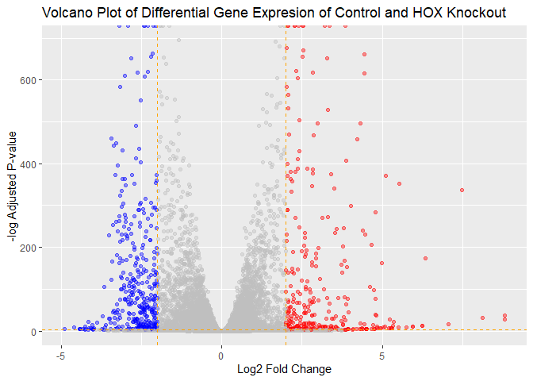

# lab14
Max Wang

- [Background](#background)
- [Data Import](#data-import)
  - [Clean up](#clean-up)
- [DESeq Analysis](#deseq-analysis)
  - [Imput Object](#imput-object)
  - [Running DESeq](#running-deseq)
  - [Results](#results)
- [Volcano plot](#volcano-plot)
- [Adding Annotations](#adding-annotations)
- [Pathway Analysis](#pathway-analysis)
  - [KEGG](#kegg)
  - [GO](#go)
  - [Reactome](#reactome)

## Background

The data from the project came from a knockdown experiment studying the
effects of the HOX gene.

## Data Import

``` r
counts <- read.csv("GSE37704_featurecounts.csv", row.names = 1)
metadata <- read.csv("GSE37704_metadata.csv", row.names = 1)

head(counts)
```

                    length SRR493366 SRR493367 SRR493368 SRR493369 SRR493370
    ENSG00000186092    918         0         0         0         0         0
    ENSG00000279928    718         0         0         0         0         0
    ENSG00000279457   1982        23        28        29        29        28
    ENSG00000278566    939         0         0         0         0         0
    ENSG00000273547    939         0         0         0         0         0
    ENSG00000187634   3214       124       123       205       207       212
                    SRR493371
    ENSG00000186092         0
    ENSG00000279928         0
    ENSG00000279457        46
    ENSG00000278566         0
    ENSG00000273547         0
    ENSG00000187634       258

``` r
metadata
```

                  condition
    SRR493366 control_sirna
    SRR493367 control_sirna
    SRR493368 control_sirna
    SRR493369      hoxa1_kd
    SRR493370      hoxa1_kd
    SRR493371      hoxa1_kd

### Clean up

Checking for ids to align from counts and metadata

``` r
new.counts <- counts[2:ncol(counts)]
all(colnames(new.counts) == rownames(metadata))
```

    [1] TRUE

Removing zero count genes

``` r
library(dplyr)
```


    Attaching package: 'dplyr'

    The following objects are masked from 'package:stats':

        filter, lag

    The following objects are masked from 'package:base':

        intersect, setdiff, setequal, union

``` r
new.counts <- new.counts %>%
  filter(rowSums(new.counts) > 0)
```

## DESeq Analysis

### Imput Object

Loading the `DESeq2` library

``` r
library(DESeq2)
```

    Warning: package 'matrixStats' was built under R version 4.4.3

Loading the data into a variable

``` r
dds <- DESeqDataSetFromMatrix(countData = new.counts,
                       colData = metadata,
                       design = ~condition)
```

    Warning in DESeqDataSet(se, design = design, ignoreRank): some variables in
    design formula are characters, converting to factors

### Running DESeq

Running the `DESeq()` function

``` r
dds <- DESeq(dds)
```

    estimating size factors

    estimating dispersions

    gene-wise dispersion estimates

    mean-dispersion relationship

    final dispersion estimates

    fitting model and testing

### Results

Running the results function to veiw the results of the DESeq output.

``` r
res <- results(dds)
```

## Volcano plot

Creating a new volcano plot to view the data

``` r
library(ggplot2)
```

    Warning: package 'ggplot2' was built under R version 4.4.3

``` r
my_cols <- rep("gray", nrow(res))
my_cols[res$log2FoldChange > 2] <- "red"
my_cols[res$log2FoldChange < -2] <- "blue"
my_cols[res$padj >0.05] <- "gray"

ggplot(res, aes(log2FoldChange, -log(padj))) +
  geom_point(color = my_cols, alpha = 0.4) +
  geom_vline(xintercept = c(-2,2), col = "orange", lty = 2) +
  geom_hline(yintercept = -log(0.05), col = "orange", lty = 2) +
  labs(x = "Log2 Fold Change", y = "-log Adjusted P-value", title = "Volcano Plot of Differential Gene Expresion of Control and HOX Knockout")
```

    Warning: Removed 1237 rows containing missing values or values outside the scale range
    (`geom_point()`).



## Adding Annotations

Adding annotation using the `AnnotationDbi` and `org.Hs.eg.db`
libraries.

``` r
library(AnnotationDbi)
```


    Attaching package: 'AnnotationDbi'

    The following object is masked from 'package:dplyr':

        select

``` r
library(org.Hs.eg.db)
```

Using the `mapIDs` function to map the ENSEMBL ids to the gene symbols
and ENTRIZ ids

``` r
res$symbol <- mapIds(org.Hs.eg.db, 
      key = row.names(res), 
      keytype = "ENSEMBL", 
      column = "SYMBOL")
```

    'select()' returned 1:many mapping between keys and columns

``` r
res$entrez <- mapIds(org.Hs.eg.db, 
      key = row.names(res), 
      keytype = "ENSEMBL", 
      column = "ENTREZID")
```

    'select()' returned 1:many mapping between keys and columns

``` r
res$name <- mapIds(org.Hs.eg.db, 
      key = row.names(res), 
      keytype = "ENSEMBL", 
      column = "GENENAME")
```

    'select()' returned 1:many mapping between keys and columns

``` r
head(res)
```

    log2 fold change (MLE): condition hoxa1 kd vs control sirna 
    Wald test p-value: condition hoxa1 kd vs control sirna 
    DataFrame with 6 rows and 9 columns
                     baseMean log2FoldChange     lfcSE       stat      pvalue
                    <numeric>      <numeric> <numeric>  <numeric>   <numeric>
    ENSG00000279457   29.9136      0.1792571 0.3248216   0.551863 5.81042e-01
    ENSG00000187634  183.2296      0.4264571 0.1402658   3.040350 2.36304e-03
    ENSG00000188976 1651.1881     -0.6927205 0.0548465 -12.630158 1.43990e-36
    ENSG00000187961  209.6379      0.7297556 0.1318599   5.534326 3.12428e-08
    ENSG00000187583   47.2551      0.0405765 0.2718928   0.149237 8.81366e-01
    ENSG00000187642   11.9798      0.5428105 0.5215598   1.040744 2.97994e-01
                           padj      symbol      entrez                   name
                      <numeric> <character> <character>            <character>
    ENSG00000279457 6.86555e-01          NA          NA                     NA
    ENSG00000187634 5.15718e-03      SAMD11      148398 sterile alpha motif ..
    ENSG00000188976 1.76549e-35       NOC2L       26155 NOC2 like nucleolar ..
    ENSG00000187961 1.13413e-07      KLHL17      339451 kelch like family me..
    ENSG00000187583 9.19031e-01     PLEKHN1       84069 pleckstrin homology ..
    ENSG00000187642 4.03379e-01       PERM1       84808 PPARGC1 and ESRR ind..

Saving results data

``` r
write.csv(res, "results.csv")
```

## Pathway Analysis

Loading the `gage`, `gageData`, and `pathview` packages to highlight
gene pathways influenced by HOX.

``` r
library(gage)
library(gageData)
library(pathview)
```

Preparing data for viewing in pathview

``` r
foldchanges = res$log2FoldChange
names(foldchanges) = res$entrez
head(foldchanges)
```

           <NA>      148398       26155      339451       84069       84808 
     0.17925708  0.42645712 -0.69272046  0.72975561  0.04057653  0.54281049 

### KEGG

Imputing data into the `gage()` function

``` r
data(kegg.sets.hs)

keggres = gage(foldchanges, gsets = kegg.sets.hs)
head(keggres$less)
```

                                                      p.geomean stat.mean
    hsa04110 Cell cycle                            8.995727e-06 -4.378644
    hsa03030 DNA replication                       9.424076e-05 -3.951803
    hsa05130 Pathogenic Escherichia coli infection 1.405864e-04 -3.765330
    hsa03013 RNA transport                         1.246882e-03 -3.059466
    hsa03440 Homologous recombination              3.066756e-03 -2.852899
    hsa04114 Oocyte meiosis                        3.784520e-03 -2.698128
                                                          p.val       q.val
    hsa04110 Cell cycle                            8.995727e-06 0.001889103
    hsa03030 DNA replication                       9.424076e-05 0.009841047
    hsa05130 Pathogenic Escherichia coli infection 1.405864e-04 0.009841047
    hsa03013 RNA transport                         1.246882e-03 0.065461279
    hsa03440 Homologous recombination              3.066756e-03 0.128803765
    hsa04114 Oocyte meiosis                        3.784520e-03 0.132458191
                                                   set.size         exp1
    hsa04110 Cell cycle                                 121 8.995727e-06
    hsa03030 DNA replication                             36 9.424076e-05
    hsa05130 Pathogenic Escherichia coli infection       53 1.405864e-04
    hsa03013 RNA transport                              144 1.246882e-03
    hsa03440 Homologous recombination                    28 3.066756e-03
    hsa04114 Oocyte meiosis                             102 3.784520e-03

visualizing the pathway with pathview

``` r
pathview(foldchanges, pathway.id = "hsa04110")
```

    'select()' returned 1:1 mapping between keys and columns

    Info: Working in directory C:/Users/eswan/OneDrive/Desktop/College Work/BIMM 143/Lab work/bimm143_github/Lab14

    Info: Writing image file hsa04110.pathview.png


### GO

Imputing data into the `gage()` function

``` r
data(go.sets.hs)
data(go.subs.hs)

gores <- gage(foldchanges, gsets = go.sets.hs[go.subs.hs$BP])
head(gores$less)
```

                                                p.geomean stat.mean        p.val
    GO:0048285 organelle fission             1.536227e-15 -8.063910 1.536227e-15
    GO:0000280 nuclear division              4.286961e-15 -7.939217 4.286961e-15
    GO:0007067 mitosis                       4.286961e-15 -7.939217 4.286961e-15
    GO:0000087 M phase of mitotic cell cycle 1.169934e-14 -7.797496 1.169934e-14
    GO:0007059 chromosome segregation        2.028624e-11 -6.878340 2.028624e-11
    GO:0000236 mitotic prometaphase          1.729553e-10 -6.695966 1.729553e-10
                                                    q.val set.size         exp1
    GO:0048285 organelle fission             5.841698e-12      376 1.536227e-15
    GO:0000280 nuclear division              5.841698e-12      352 4.286961e-15
    GO:0007067 mitosis                       5.841698e-12      352 4.286961e-15
    GO:0000087 M phase of mitotic cell cycle 1.195672e-11      362 1.169934e-14
    GO:0007059 chromosome segregation        1.658603e-08      142 2.028624e-11
    GO:0000236 mitotic prometaphase          1.178402e-07       84 1.729553e-10

### Reactome

For Reactome, we need to prepare our data into a tabular format to
download and load into the Reactome website.

``` r
sig_genes <- res[res$padj <= 0.05 & !is.na(res$padj), "symbol"] # filter genes for non NA and significant genes 
length(sig_genes)
```

    [1] 8147

Writing a table to input into Reactome

``` r
write.table(sig_genes, file="significant_genes.txt", row.names=FALSE, col.names=FALSE, quote=FALSE)
```

From here we can take the file and analyze it using their online
website.


> Q: What pathway has the most significant “Entities p-value”? Do the
> most significant pathways listed match your previous KEGG results?
> What factors could cause differences between the two methods?


The most significant pathway was the mitotic cell cycle pathway which
did align with the KEGG results. Differences might result due to the
different data sets that KEGG and Reactome use.
