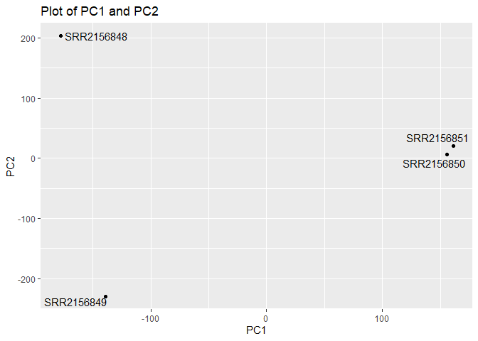
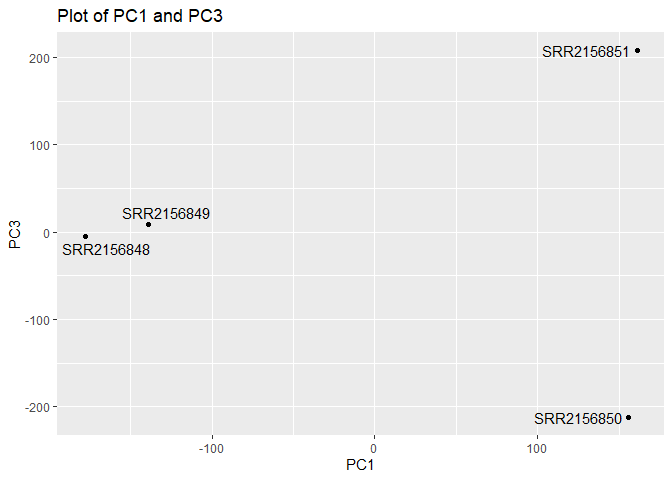
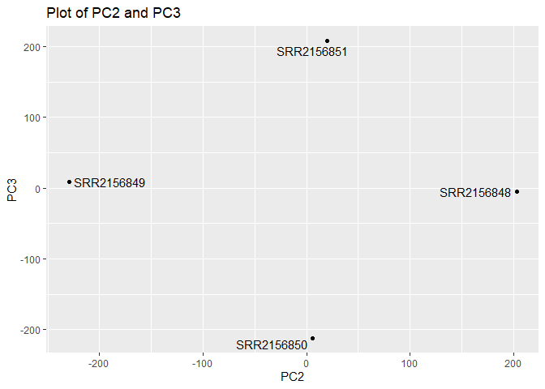

# lab17
Max Wang

- [Importing data from sequence
  analysis](#importing-data-from-sequence-analysis)
- [PCA Analysis](#pca-analysis)

## Importing data from sequence analysis

``` r
library(tximport)

# setup the folder and file-names to read
folders <- dir(pattern="SRR21568*")
samples <- sub("_quant", "", folders)
files <- file.path( folders, "abundance.h5" )
names(files) <- samples

txi.kallisto <- tximport(files, type = "kallisto", txOut = TRUE)
```

    1 2 3 4 

``` r
head(txi.kallisto$counts)
```

                    SRR2156848 SRR2156849 SRR2156850 SRR2156851
    ENST00000539570          0          0    0.00000          0
    ENST00000576455          0          0    2.62037          0
    ENST00000510508          0          0    0.00000          0
    ENST00000474471          0          1    1.00000          0
    ENST00000381700          0          0    0.00000          0
    ENST00000445946          0          0    0.00000          0

searching for the total number of entries

``` r
colSums(txi.kallisto$counts)
```

    SRR2156848 SRR2156849 SRR2156850 SRR2156851 
       2563611    2600800    2372309    2111474 

total entries with nonzero reads across all samples

``` r
sum(rowSums(txi.kallisto$counts) > 0)
```

    [1] 94561

filtering out zero count genes and genes with no change

``` r
keep <- rowSums(txi.kallisto$counts) > 0
kset_trimed <- txi.kallisto$counts[keep, ]

keep2 <- apply(kset_trimed,1,sd) > 0
x <- kset_trimed[keep2, ]
head(x)
```

                    SRR2156848 SRR2156849 SRR2156850 SRR2156851
    ENST00000576455    0.00000  0.0000000    2.62037   0.000000
    ENST00000474471    0.00000  1.0000000    1.00000   0.000000
    ENST00000420022    0.00000  2.0000000    4.00000   4.000000
    ENST00000553856   10.96649  5.2579568   13.11994   2.720173
    ENST00000556126    0.00000  0.0000000    4.00000   0.000000
    ENST00000483851    0.00000  0.6084246    0.00000   0.000000

## PCA Analysis

Running PCA on the trimmed dataset

``` r
pca <- prcomp(t(x), scale = T)
summary(pca)
```

    Importance of components:
                                PC1      PC2      PC3   PC4
    Standard deviation     183.6379 177.3605 171.3020 1e+00
    Proportion of Variance   0.3568   0.3328   0.3104 1e-05
    Cumulative Proportion    0.3568   0.6895   1.0000 1e+00

Plot of PC1 and PC2

``` r
library(ggplot2)
```

    Warning: package 'ggplot2' was built under R version 4.4.3

``` r
library(ggrepel)
```

    Warning: package 'ggrepel' was built under R version 4.4.3

``` r
plot <- ggplot(pca$x, aes(x = PC1, y = PC2, label = rownames(pca$x))) +
  geom_point() +
  geom_text_repel() +
  labs(title = "Plot of PC1 and PC2")
plot
```



Plot of PC1 and PC3

``` r
plot2 <- ggplot(pca$x, aes(x = PC1, y = PC3, label = rownames(pca$x))) +
  geom_point() +
  geom_text_repel() +
  labs(title = "Plot of PC1 and PC3")
plot2
```



Plot of PC2 and PC3

``` r
plot3 <- ggplot(pca$x, aes(x = PC2, y = PC3, label = rownames(pca$x))) +
  geom_point() +
  geom_text_repel() +
  labs(title = "Plot of PC2 and PC3")
plot3
```


